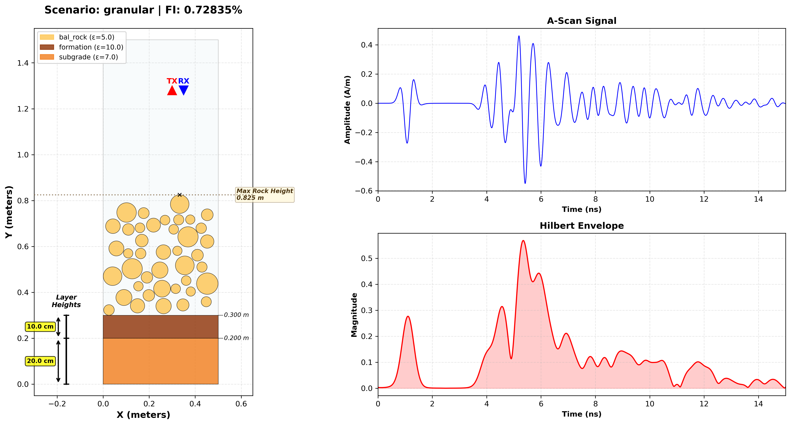

# Blueprint Visualization Guide

The **Blueprint Visualization** tool (`visualize_gprmax_blueprint.py`) provides a comprehensive health-check of your synthetic data. It combines the physical geometry definition with the simulated electromagnetic response into a single dashboard.

## Overview

The blueprint allows you to instantly verify:
1.  **Geometry Correctness**: Are layers (ballast, subgrade) where they should be? Are rocks physically placed?
2.  **Simulation Success**: Did the simulation run? Is there a valid signal?
3.  **Signal Physics**: Does the signal look like a GPR A-Scan? Is the reflection energy consistent with the material properties?



## Components

### 1. Geometry Cross-Section (Left)
This panel visualizes the `.in` file commands.
*   **Layers**: Different materials are color-coded (see Legend).
*   **Ruler**: A vertical ruler on the left shows the exact height of major layers (e.g., Subgrade, Formation, Ballast).
*   **Objects**:
    *   **Rectangles**: Represent homogeneous layers (boxes).
    *   **Circles**: Represent individual aggregate stones (in granular mode).
    *   **Triangles**: Red (TX) and Blue (RX) markers show antenna positions.
*   **Annotations**: Special markers (e.g., "Max Rock Height") help verify random distribution limits.

### 2. A-Scan Signal (Top Right)
Displays the raw **Hx (Magnetic Field)** component recorded by the receiver.
*   **X-Axis**: Time in nanoseconds (ns).
*   **Y-Axis**: Amplitude (A/m).
*   **Interpretation**: The "wiggles" represent reflections from dielectric boundaries. The first major pulse is usually the direct wave (air/ground coupling), followed by reflections from the ballast bottom and subgrade.

### 3. Hilbert Envelope (Bottom Right)
Displays the **Instantaneous Amplitude** (Magnitude of the Analytic Signal).
*   **Red Shaded Area**: Represents the energy packet shape.
*   **Interpretation**: This is critical for fouling detection.
    *   **Clean Ballast**: Shows sharp, distinct pulses (high contrast interfaces).
    *   **Fouled Ballast**: Shows a wider, more "smeared" envelope due to scattering and attenuation from the fouling matrix.

## Usage

Run the tool on any `.in` file. If a corresponding `.out` file exists in the same folder, the signal plots will be generated automatically.

```bash
# Basic usage
python scripts/tools/visualization/visualize_gprmax_blueprint.py path/to/sample.in

# Save to file without opening window
python scripts/tools/visualization/visualize_gprmax_blueprint.py path/to/sample.in -o blueprint.png --no-show
```
