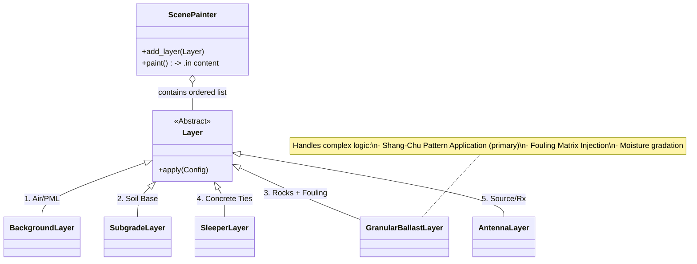
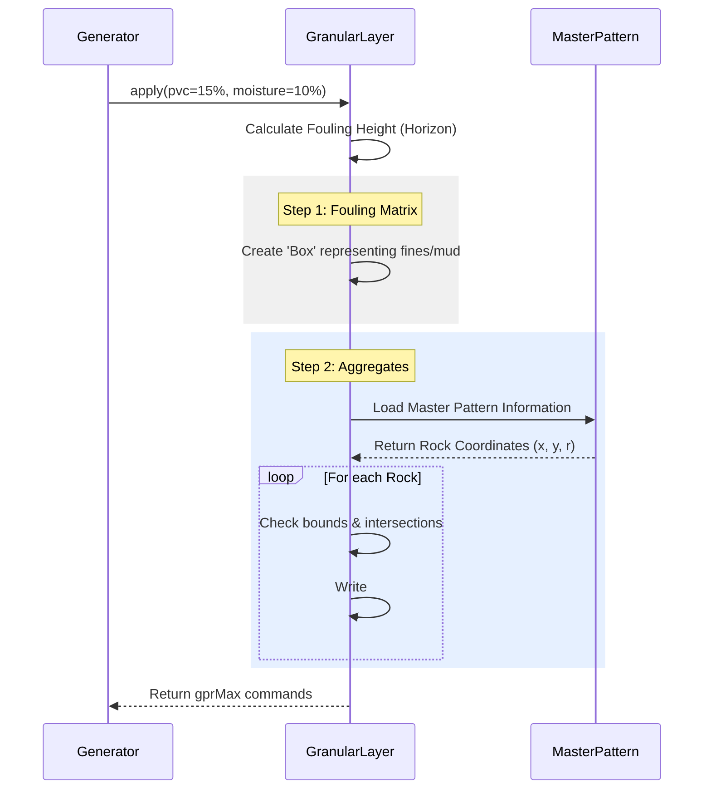

# Visualizing the Generation Process

This document explains the internal logic of the `generate_in_files` pipeline using visual diagrams.

## 1. High-Level Process Flow

The generation script acts as an orchestrator that converts configuration and random distributions into physical GPR models.

```mermaid
graph TD
    A([Start: generate_in_files.py]) --> B{Load Config}
    B -->|CLI Args| C[Initialize Generator]
    C --> D[Loop: For each Label (CL, MC...)]
    D --> E[Loop: For each Sample (1..N)]
    
    subgraph "Scenario Sampling"
    E --> F[Randomize Parameters]
    F -->|PVC, Moisture| G[Calculate Dielectrics]
    F -->|Depth| H[Sample Ballast Height]
    end
    
    subgraph "Composition (ScenePainter)"
    G & H --> I[Compose Geometry]
    I --> J[Add Background Layer]
    J --> K[Add Subgrade & Formation]
    K --> L{Granular Mode?}
    L -->|Yes| M[Placing Aggregates (Shang-Chu Pattern)]
    L -->|No| N[Legacy Simple Box Model]
    M & N --> O[Add Sleepers & Antenna]
    end
    
    O --> P[Write .in File]
    P --> Q[Append to Metadata CSV]
    Q --> E
    E --> D
    D --> R([End])
    
    style I fill:#f9f,stroke:#333,stroke-width:2px
    style M fill:#bbf,stroke:#333
    style L fill:#ff9,stroke:#333
```

## 2. The Scene Painter (Layering System)

The generator uses a "Painter's Algorithm" approach. It builds the gprMax model layer by layer, from bottom to top. This ensures that objects drawn later (like sleepers) correctly "overwrite" or sit on top of previous layers (like ballast).



## 3. Granular Ballast Generation

When `Granular Mode` is active, the geometry is constructed physically rather than just using dielectric blocks.


