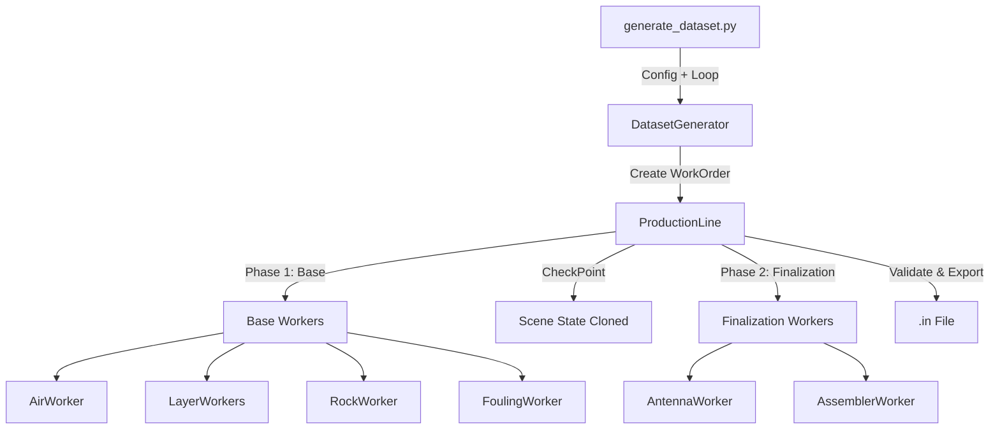

# Synthetic Data Generation Process

This document details the architecture and workflow of the synthetic GPR data generation system associated with the `Synth-GPR` project.

## Architecture Overview

The system uses a **Factory Pattern** metaphor to generate GPR input files (`.in`).

*   **ProductionLine**: The orchestrator that manages the generation lifecycle.
*   **WorkOrder**: A data object carrying the specifications (PVC, moisture, etc.) for a single sample.
*   **Workers**: Specialized agents that build specific parts of the scene (e.g., `RockWorker`, `AntennaWorker`).
*   **RecipeBook**: Defines the sequence of Workers to execute.

## Flow Diagram

## Step-by-Step Process

### 1. Initialization
The process starts in `scripts/main/generate_dataset.py`.
1.  **Configuration**: Loads parameters from `config.ini` or command line arguments.
2.  **Sampling**: For each sample to be generated, `DatasetGenerator` samples parameters (like specific PVC or rock distribution) and creates a `WorkOrder`.

### 2. Base Construction Phase
The `ProductionLine` spins up and runs the "Base Recipe" of workers in order:

1.  **AirWorker**: Creates the air box (free space) encompassing the entire domain.
2.  **SubgradeWorker**: Adds the bottom soil layer.
3.  **FormationWorker**: Adds the sub-ballast layer (transition layer).
4.  **BallastWorker**: Defines the ballast layer boundaries (but not the rocks yet).
5.  **RockWorker**:
    *   Generates thousands of individual rock particles (cylinders).
    *   Uses packing algorithms (e.g., `FrontChainPacking`) to simulate realistic aggregate distribution.
    *   Calculates achieved density and porosity.
6.  **DegradationWorker** (Optional): Simulates rock breakage or wear if enabled.
7.  **FoulingWorker**:
    *   Calculates the volume of fouling material needed based on the requested PVC (Percentage Void Contamination).
    *   Fills the voids between rocks with fouling material (simulated as fines/mud).
    *   Can simulate "settled" layers or dispersed particles.

### 3. Finalization Phase
After the physical railway structure is built, the "Finalization Recipe" runs:

1.  **AntennaWorker**:
    *   Calculates the correct height for the GPR antenna (preserving standoff distance).
    *   Adds the Transmitter (TX) and Receiver (RX) to the scene.
2.  **AssemblerWorker**:
    *   Performs final geometry checks (e.g., ensuring antenna isn't inside a rock).
    *   Adds the `#geometry_view` command for Paraview visualization.
3.  **LabWorker**:
    *   Simulates a virtual sieve analysis to calculate the "Fouling Index" (FI) of the generated geometry, providing ground truth labels.

### 4. Output
Finally, the `ProductionLine` serializes the scene into a gprMax input file (`.in`).
*   Metadata (PVC, FI, Class) is returned to the `DatasetGenerator` and saved to `metadata.csv`.

## Key Logic Locations

| component | File | Responsibility |
|or |---|---|
| **Orchestrator** | `src/production_line.py` | Manages the worker sequence and shared state. |
| **Worker Logic** | `src/workers.py` | Implementation of individual workers (Air, Rock, Antenna, etc.). |
| **Rock Packing** | `src/rock_packing.py` | Algorithms for placing rocks without overlap. |
| **Data Packet** | `src/work_order.py` | Carries parameters and results between workers. |
