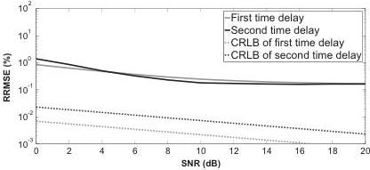
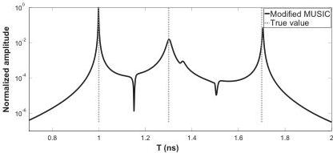
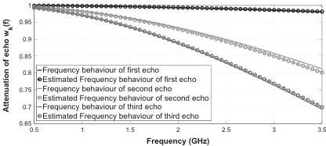

M. Sun et al. / Signal Processing 132 (2017) 272–283

281

Table 2
Estimated time delays and roughness parameters by modified MUSIC and MLE.  \( \hat{t}_{k} \)  and  \( \hat{b}_{k} \)  represent estimated time delays and estimated roughness parameters, respectively.

|  Parameter | Case1 overlapped | Case2 overlapped | Case3 overlapped | Case1 non-overlapped | Case1 overlapped with low-loss media  |
| --- | --- | --- | --- | --- | --- |
|  \( \hat{t}_{1} \) (ns) | 1.000 | 1.000 | 0.999 | 1.000 | 1.000  |
|  \( \hat{t}_{2} \) (ns) | 1.299 | 1.302 | 1.301 | 1.302 | 1.306  |
|  \( \hat{b}_{1} \) (GHz\( ^{-2} \)) | \( 1.96 \times 10^{-3} \) | \( 2.69 \times 10^{-3} \) | \( 4.40 \times 10^{-3} \) | \( 1.41 \times 10^{-3} \) | \( 3.52 \times 10^{-3} \)  |
|  \( \hat{b}_{2} \) (GHz\( ^{-2} \)) | \( 1.52 \times 10^{-2} \) | \( 2.49 \times 10^{-2} \) | \( 4.02 \times 10^{-2} \) | \( 1.60 \times 10^{-2} \) | \( 1.76 \times 10^{-2} \)  |

Fig. 16. Simulation 2, RRMSE on the estimated time delay \( t_k \), (\( k = 1, 2 \)) vs. SNR after 500 Monte-Carlo simulations for case 1, slightly overlapped.

Fig. 17. Simulation 3, Pseudo-spectrum of MUSIC for time delay estimation with SNR=20 dB, the three time delays are 1 ns, 1.3 ns and 1.7 ns in grey dashed line.

Fig. 18. Simulation 3, Expression for frequency behaviour of backscattered echoes by using estimated roughness parameter versus frequency behaviour of backscattered echoes from radar data.