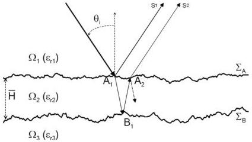

M. Sun et al. / Signal Processing 132 (2017) 272–283

273

roughness). Nevertheless, it is suitable only for narrow band (less than 2 GHz). With the widening of the frequency band, the curve fitting error will increase rapidly, which may bring errors to the interface roughness estimation. In order to reduce the errors coming from the curve fitting, we propose a modified MUSIC algorithm which can take into account several possible frequency behaviours, more adaptable for ultra-wideband GPR. Like in [19,20], we also focus on the estimation of time delays and interface roughness. Unlike the methods in [19,20], the proposed method allows estimating the time delays without knowing the frequency behaviour from roughness. Then, the roughness parameter is estimated by MLE [22] with the estimated time delays from the modified MUSIC algorithm. This step uses a model of which the roughness frequency behaviour is approximated as a Gaussian function. The performance of the proposed algorithm is tested on data simulated from PILE method [13,23–25], which is based on the MoM.

This paper is organised as follows. Section 2 gives the simulation results of the scattering of EM waves from random rough interfaces, and studies the frequency behaviour of the backscattered echoes. In Section 3, the radar data model and preprocessing methods are presented. In Section 4, a modified MUSIC algorithm is proposed to estimate the time delays without knowing the frequency behaviour. Moreover, the roughness parameters are estimated by MLE [22]. Simulation results and a discussion on the performance of the proposed algorithm are given in Section 5. Finally, conclusions and perspectives are drawn.

# 2. Rough pavement scattering model

In order to give some ideas about the scattering from a rough pavement, a realistic simulation of a typical thin asphalt road structure (pavement layer) is considered. The rigorous electromagnetic method PILE (propagation inside layer expansion) [23,25] based on the MoM, provides simulation data that allows showing the influence of the interface roughness on the backscattered echoes of stratified media. The simulation parameters are chosen to match the air-coupled radar configuration at vertical incidence that is used for pavement survey at traffic speed; the probing scope is assumed to be limited to the first two layers of the pavement structure. The considered pavement structure is an Ultra-Thin Asphalt Surfacing (UTAS), which is made of a layer medium $\Omega_2$ with mean thickness $H = 20$ mm. For the rolling band (or base band) corresponding to the medium $\Omega_3$, it has the same composition as the medium $\Omega_2$, see Fig. 1. We assume that $\Omega_2$ and

$\Omega_2$ are homogeneous media for a normal incidence angle ($\theta_i = 0$ in Fig. 1) and the frequency band under study is $[0.5, 10.5]$ GHz. For the considered media, their relative permittivity $\varepsilon_r$ typically ranges between 4 and 8. Moreover, in this paper, the media are assumed to be lossless. For the simulations, we take $\varepsilon_{r2} = 4.5$ and $\varepsilon_{r3} = 7$. The two rough interfaces $\Sigma_A$ and $\Sigma_B$ are assumed to have a Gaussian height probability density function and an exponential height autocorrelation function [26,27]. For $\Sigma_A$, the RMS height $\sigma_{hA}$ is about 0.6 – 1 mm, and the correlation length $L_{cA}$ is about 5–10 mm [26,27]. For $\Sigma_B$, the RMS height $\sigma_{hB}$ and the correlation length $L_{cB}$ are greater than those of $\Sigma_A$. It is assumed that the antenna radiates a vertically polarized plane wave in far field of probed pavement (in practice, the antenna is about 400 mm above the rough surface). The typical width of a probed surface antenna footprint is about 300 – 500 mm. In the simulations, we consider surfaces of length $L = 2400$ mm, illuminated by a Thorsos beam (the Thorsos beam is a tapered plane wave, whose tapering has a Gaussian shape; the tapering is used to reduce the incident field to near zero at the edges of the surface realisations and thereby to reduce edge effects to negligible levels) of attenuation parameter $g = L/8$. The two rough interfaces are sampled with a sampling step $\Delta x = Re(\lambda_2)/8$, where $\lambda_2$ is the wavelength inside $\Omega_2$ with $\lambda_2 = \lambda_0/\sqrt{\varepsilon_{r2}}$ ($\lambda_0$ is the wavelength in vacuum) and $Re(\dots)$ is the real part. We take an incident wave with normal incidence ($\theta_i = 0$), and then calculate the first two scattered echoes $s_1$ and $s_2$ from the scattered field.

In order to investigate the influence of interface roughness on the backscattered echoes, a rough pavement is tested, with roughness parameters $\sigma_{hA} = 1.0$ mm, $L_{cA} = 6.4$ mm, $\sigma_{hB} = 2.0$ mm, $L_{cB} = 15$ mm. According to the selected parameters, PILE method provides the first two backscattered echoes $s_1$ and $s_2$ at each frequency over the frequency band $f \in [0.5, 10.5]$ GHz, with sampling step $\Delta f = 0.1$ GHz. Simulated data were obtained by a Monte Carlo process with 100 independent realizations. Two models are presented: an exponential shape and a Gaussian shape. For doing so, a curve fitting is made by using least squares method to estimate the parameters of the model. In [19,20], the exponential shape $|s(f)| = s_k \times \exp(-\bar{b}f)$ with roughness parameter $\bar{b}$ of the scattered echo amplitude is studied. In this paper, we introduce a Gaussian shape $|s(f)| = s_k \times \exp(-bf^2)$ with a different roughness parameter $b$; where $s_k$ is the amplitude of the considered backscattered echo in the flat pavement.

Curve fittings are made with radar data from PILE in 3 narrow bands ($f \in [0.5, 1.5]$ GHz, $f \in [0.5, 2.5]$ GHz, $f \in [0.5, 3.5]$ GHz) and 3 large bands ($f \in [0.5, 6.5]$ GHz, $f \in [0.5, 8.5]$ GHz, $f \in [0.5, 10.5]$ GHz). Figs. 2 and 3 give the frequency behaviour of

Fig. 1. Rough Pavement Configuration.