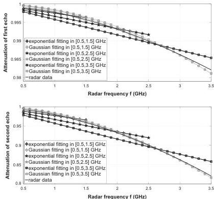
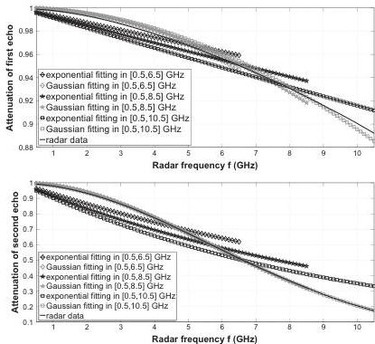

274

M. Sun et al. / Signal Processing 132 (2017) 272–283

Fig. 2. Frequency behaviour of echoes with curve fitting results in [0.5, 1.5] GHz, [0.5, 2.5] GHz and [0.5, 3.5] GHz.

Fig. 3. Frequency behaviour of echoes with curve fitting results in [0.5, 6.5] GHz, [0.5, 8.5] GHz and [0.5, 10.5] GHz.

the backscatter echoes. We can notice that the amplitudes of the backscattered echoes are decreasing when the frequency increases, especially for the second echo. Thus, the influence of the

interface roughness cannot be neglected any more, the frequency behaviour of the echoes should be considered in radar data processing. In addition, Figs. 2 and 3 also show the curve fitting