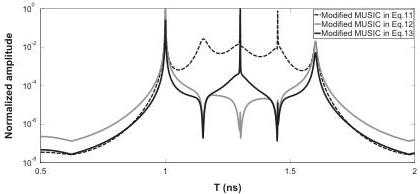

276

M. Sun et al. / Signal Processing 132 (2017) 272–283

Fig. 4. Pseudo-spectrum of MUSIC for time delay estimation with SNR=30 dB, the three time delays are 1 ns, 1.3 ns and 1.6 ns.

where B is a transformation matrix of interpolation (the details of the interpolation are provided in Appendix A). In the following section, a modified MUSIC algorithm is proposed and applied for TDE. This method assumes that the noise is a Gaussian white noise. To ensure this condition, like in [20], the noise covariance matrix should be removed. As the radar pulse (measured by the echo backscattered from a metallic plane) and the transformation matrix B are known, and the noise variance σ² is estimated by the propagator method [34], the new noise free covariance matrix R can be written as follows:

$$\mathbf{R} = \mathbf{BASA}^H\mathbf{B}^H + 0 \times \mathbf{I} \approx \mathbf{R} - \hat{\sigma}^2\mathbf{B}\Sigma\mathbf{B}^H \tag{7}$$

where δ² is the estimated noise variance. Then, the spatial smoothing preprocessing technique can be applied [35]. The SSP technique estimates the modified covariance matrix RSSP as follows [35]:

$$\mathbf{R}_{SSP} = \frac{1}{M} \sum_{k=1}^{M} \mathbf{R}_k \tag{8}$$

where Rk is the kth sub-band of the covariance matrix R, N frequencies, M overlapping sub-bands of length L are considered. N, M and L are related to one another by:

$$N = L + M - 1$$

### 4. Time delay and interface roughness estimation

When the interface roughness is taken into account, high resolution algorithms like MUSIC or ESPRIT cannot be used directly in theory, due to the unknown frequency behaviour wh(f) of the echoes. Therefore, we propose a modified MUSIC algorithm to estimate the time delays, and then MLE is used to estimate the interface roughness.

### 4.1. Modified music algorithm

In this section, a modified MUSIC algorithm is proposed, which allows estimating only the time delays. The mode vector a can be written as follows:

$$\begin{array}{l} \mathbf{a}(t) = [\exp(-2j\pi f_1 t)\hat{w}(f_1)\exp(-2j\pi f_2 t)\hat{w}(f_2) \\ \quad \dots \exp(-2j\pi f_L t)\hat{w}(f_L)]^T \\ = \text{diag}\{\exp(-2j\pi f_1 t), \exp(-2j\pi f_2 t) \\ \quad \dots, \exp(-2j\pi f_L t)\}[\hat{w}(f_1)\hat{w}(f_2)\dots\hat{w}(f_L)]^T \\ = \tilde{\mathbf{A}}\mathbf{k} \end{array}$$

where $$\tilde{\mathbf{A}} = \text{diag}\{\exp(-2j\pi f_1 t), \exp(-2j\pi f_2 t), \dots, \exp(-2j\pi f_L t)\}$$ and $$\mathbf{k} = [\hat{w}(f_1)\hat{w}(f_2)\dots\hat{w}(f_L)]^T$$ with $$\hat{w}(f)$$ the frequency behaviour of the backscattered echoes after interpolation. k is a real vector.

The pseudo-spectrum of MUSIC can be written as:

$$P(t) = \left[ \min_k \left\{ \frac{\mathbf{k}^H\tilde{\mathbf{A}}^H\mathbf{U}_N\mathbf{U}_N^H\tilde{\mathbf{A}}\mathbf{k}}{\mathbf{k}^H\tilde{\mathbf{A}}^H\tilde{\mathbf{A}}\mathbf{k}} \right\} \right]^{-1} \tag{9}$$

where UN is the L × (L − K) noise matrix whose columns are the L − K noise eigenvectors. Referring to [36], P(t) is equal to the minimum generalized eigenvalue λmin of $$\tilde{\mathbf{A}}^H\mathbf{U}_N\mathbf{U}_N^H\tilde{\mathbf{A}}$$ and $$\tilde{\mathbf{A}}^H\tilde{\mathbf{A}}$$, satisfying (with kmin the corresponding generalized eigenvector):

$$\tilde{\mathbf{A}}^H\mathbf{U}_N\mathbf{U}_N^H\tilde{\mathbf{A}}\mathbf{k}_{min} = \lambda_{min}\tilde{\mathbf{A}}^H\tilde{\mathbf{A}}\mathbf{k}_{min} = \lambda_{min}\mathbf{k}_{min} \tag{10}$$

The pseudo-spectrum of MUSIC can also be written as the reciprocal of the minimum eigenvalue of real{$$\tilde{\mathbf{A}}^H\mathbf{U}_N\mathbf{U}_N^H\tilde{\mathbf{A}}$$} [36,37]:

$$P(t) = \frac{1}{\lambda_{min}(t)} \tag{11}$$

By using (11), we need only to search the spectrum in the time domain without knowing the influence of the frequency behaviour. Nevertheless, it has a false peak in the middle of two true values. For example, when two echoes are considered, we assume that t₁ and t₂ (t₂ > t₁) are the time delays of the echoes, then we can prove that t₃ = (t₂ - t₁)/2 is also a solution of λmin(t) = 0 (the proof is given in Appendix B). In [37], based on the characteristics of λmin(t) corresponding to the false time delay and the true time delays, they propose a new pseudo-spectrum of MUSIC to cancel the false time delay, which can be expressed as follows:

$$P(t) = 10 \log_{10} \left\{ \frac{\lambda_1(t)}{\lambda_2(t)} \right\} \tag{12}$$

where λk(t) is the kth eigenvalue of real{$$\tilde{\mathbf{A}}^H\mathbf{U}_N\mathbf{U}_N^H\tilde{\mathbf{A}}$$}, and λL(t) ≥ λL−1(t) ≥ ... ≥ λ1(t). Still, the above method only works for the case of two echoes. Indeed, for the case where the number of echoes is superior to 2, Eq. (12) does not work. For example, when a true time delay has the same value as a false one, this true time delay will also be cancelled. From Appendix B, we show that the number of zero eigenvalues of real{$$\tilde{\mathbf{A}}^H\mathbf{U}_N\mathbf{U}_N^H\tilde{\mathbf{A}}$$} corresponding to the true time delay is odd, and to the false time delay, this number is even. Based on the above characteristics, we propose a generalized pseudo-spectrum for modified MUSIC as follows: