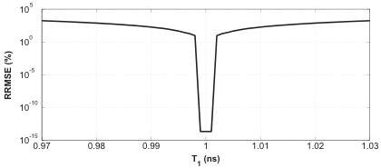
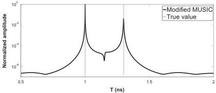

M. Sun et al. / Signal Processing 132 (2017) 272–283

277

Fig. 5. RRMSE on the estimated roughness parameter $b_1 = 1.10 \times 10^{-3} \text{ GHz}^{-2}$ ($\sigma_{hA} = 0.5 \text{ mm}$, $L_{cA} = 6.4 \text{ mm}$) against first time delay $T_1 = 1 \text{ ns}$ in a noiseless environment by MLE.

$$P(t) = \begin{cases} \frac{\lambda_2(t)}{\lambda_1(t)} \frac{\lambda_4(t)}{\lambda_3(t)} \cdots \frac{\lambda_{L-1}(t)}{\lambda_{L-2}(t)} & L = 2n + 1 \\ \frac{\lambda_2(t)}{\lambda_1(t)} \frac{\lambda_4(t)}{\lambda_3(t)} \cdots \frac{\lambda_L(t)}{\lambda_{L-1}(t)} & L = 2n \end{cases} \tag{13}$$

where $n = 0, 1, 2 \dots$ and $L$ can be an odd or even number. The pseudo-spectrums of MUSIC in (11), (12) and (13) are shown in Fig. 4. In the simulation, 3 time delays (1 ns, 1.3 ns and 1.6 ns) are considered, the second time delay is in the middle of the other two time delays. In order to make a better comparison between the three pseudo-spectrums, an amplitude normalization is made in Fig. 4. Modified MUSIC in (11) obtains two false peaks at 1.15 ns and 1.45 ns. By using (12), the two false peaks are removed, but also the second time delay. Only the proposed method (13) can successfully remove the false time delays and keep the true time delays. Thus, Eq. (13) is used in the following of the paper.

### 4.2. MLE for roughness parameter estimation

For the frequency behaviour of backscattered echoes, it has been found in the previous section that the frequency behaviour $w(f)$ can be approximated by a Gaussian function for ultra wide band radar. It enables a parametrization of the frequency variations for data modelling. We assume that the frequency behaviour can be expressed as $w_k(f_i) = \exp(-b_k f_i^2)$, where $b_k$ is the roughness parameter of the $k$th interface. For flat interfaces, $b_k = 0$. This parameter can be calculated by MLE [22] with estimated time delays, the details of the calculation are given in Appendix C. We should notice that the roughness parameters are very sensitive to the bias of the estimated time delay, especially when the roughness parameters are very small, as shown in Fig. 5 (only the first

layer is considered). Note that when the value of $T_1$ is not the true value, the relative-root-mean-square error (RRMSE) on roughness parameter $b_1$ increases drastically.

### 5. Simulations and discussion

In the simulations, the performance of the modified MUSIC and MLE is tested on the data provided by PILE method. The simulated data represent the radar backscattered signal at nadir from a rough pavement made of two rough interfaces separating homogeneous media. The studied pavement structure is made of a layer of UTAS with a relative permittivity equal to 4.5 overlying a base band with a relative permittivity equal to 7. We consider two scattered echoes corresponding to the time delays 1 ns and 1.3 ns, which corresponds to thickness of the first layer of approximately 20 mm and the second layer is infinite. In the simulations, four pavements are studied (the rough interfaces are assumed to have a Gaussian height probability density function and an exponential height autocorrelation function) [26,27] with different root mean square heights $\sigma_h$, correlation lengths $L_h$ and conductivities of the layers $\delta$:

- Case 1. $\sigma_{hA} = 1.0 \text{ mm}$, $L_{cA} = 6.4 \text{ mm}$, $\sigma_{hB} = 2.0 \text{ mm}$, $L_{cB} = 15 \text{ mm}$, lossless media.
- Case 2. $\sigma_{hA} = 1.0 \text{ mm}$, $L_{cA} = 6.4 \text{ mm}$, $\sigma_{hB} = 2.5 \text{ mm}$, $L_{cB} = 15 \text{ mm}$, lossless media.
- Case 3. $\sigma_{hA} = 1.5 \text{ mm}$, $L_{cA} = 6.4 \text{ mm}$, $\sigma_{hB} = 3.0 \text{ mm}$, $L_{cB} = 15 \text{ mm}$, lossless media.
- Case 4. $\sigma_{hA} = 1.0 \text{ mm}$, $L_{cA} = 6.4 \text{ mm}$, $\sigma_{hB} = 2.0 \text{ mm}$, $L_{cB} = 15 \text{ mm}$, low-loss media ($\delta_A = 5 \times 10^{-3} \text{ S/m}$, $\delta_B = 10^{-2} \text{ S/m}$).

When the frequency band is 0.5 – 3.5 GHz, with 0.05 GHz

Fig. 6. Case 1, Pseudo-spectrum of MUSIC for time delay estimation with SNR=20 dB, the two time delays are 1 ns and 1.3 ns in grey dashed line, slightly overlapped.