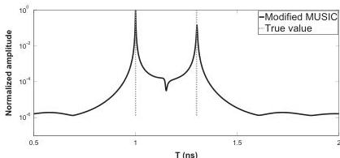
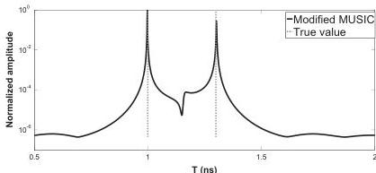
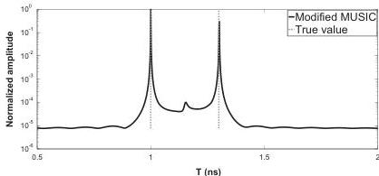

278

M. Sun et al. / Signal Processing 132 (2017) 272–283

Fig. 7. Case 2, Pseudo-spectrum of MUSIC for time delay estimation with SNR=20 dB, the two time delays are 1 ns and 1.3 ns in grey dashed line, slightly overlapped.

Fig. 8. Case 3, Pseudo-spectrum of MUSIC for time delay estimation with SNR=20 dB, the two time delays are 1 ns and 1.3 ns in grey dashed line, slightly overlapped.

Fig. 9. Case 1, Pseudo-spectrum of MUSIC for time delay estimation with SNR=20 dB, the two time delays are 1 ns and 1.3 ns in grey dashed line, non-overlapped.

frequency step (61 frequency samples), the echoes are slightly overlapped. When the frequency band is 0.5 – 6.5 GHz, with 0.1 GHz frequency step (61 frequency samples), the echoes are non-overlapped. The covariance matrix is estimated from 1000 independent snapshots. The interpolated SSP technique is used to reduce the cross-correlation between the echoes and the number of sub-bands (M) is equal to 20. The signal-to-noise ratio (SNR) is defined as the ratio between the powers of the second echo and noise variance. In the first simulation, a fixed SNR=20 dB is used for three different rough pavements.

Figs. 6–10 show the pseudo-spectrums of modified MUSIC. Two peaks corresponding to the time delays of the first two scattered echoes are well estimated. Simulation results demonstrate that the

proposed algorithm can handle cases where both echoes are either overlapped or non-overlapped and for either lossless or low-loss media. The roughness parameters could also be estimated by using the MLE with the estimated time delays (see Figs. 11–15). Table 2 gives the results of estimated time delays ($\hat{t}_k$) and estimated roughness parameters ($\hat{b}_k$). We compare the estimated frequency behaviours with the data from PILE in Figs. 11–15. From the frequency behaviour of the four different cases, it is shown that the expressions of the echoes are in agreement with the data from PILE for various roughness parameters with either lossless media or low-loss media.

Then, in the second simulation, we evaluate the performance of