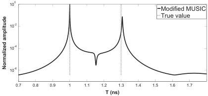
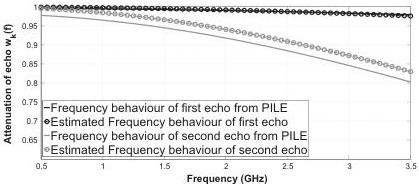
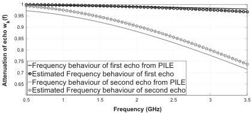

M. Sun et al. / Signal Processing 132 (2017) 272–283

279

Fig. 10. Case 4, Pseudo-spectrum of MUSIC for time delay estimation with SNR=20 dB, the two time delays are 1 ns and 1.3 ns in grey dashed line, slightly overlapped, low-loss media.

Fig. 11. Case 1, Expression for frequency behaviour of backscattered echoes by using estimated roughness parameter versus frequency behaviour of backscattered echoes from radar data, slightly overlapped.

Fig. 12. Case 2, Expression for frequency behaviour of backscattered echoes by using estimated roughness parameter versus frequency behaviour of backscattered echoes from radar data, slightly overlapped.

modified MUSIC, which is assessed with a Monte-Carlo process of 500 independent runs of the algorithm with independent noise snapshots and from the RRMSE of the evaluated parameter as follows:

$$RRMSE(z) = \frac{\sqrt{\frac{1}{U} \sum_{j=1}^{U} \left( \hat{z}_j - z \right)^2}}{z}, \tag{14}$$

where $\hat{z}_j$ denotes the estimated parameter for the $j$th run of the

algorithm, and $z$ the true value. In the simulation, the parameter $z$ can represent either the first ($t_1$) or the second ($t_2$) time delay. Only case 1 is considered. In the time delay estimation, as expected, it can be seen that the RRMSE is continuously decreasing when the SNR increases. Fig. 16 shows that the proposed method gives relatively good performances in TDE.

In the third simulation, the performance of the proposed method is tested on a pavement which is composed of 3 rough interfaces (four layers). The simulation parameters of the pavement are chosen as follows: the permittivities of first three layers