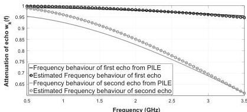
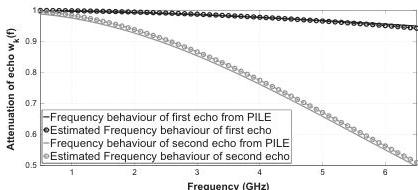
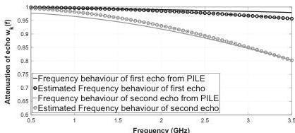

280

M. Sun et al. / Signal Processing 132 (2017) 272–283

Fig. 13. Case 3, Expression for frequency behaviour of backscattered echoes by using estimated roughness parameter versus frequency behaviour of backscattered echoes from radar data, slightly overlapped.

Fig. 14. Case 1, Expression for frequency behaviour of backscattered echoes by using estimated roughness parameter versus frequency behaviour of backscattered echoes from radar data, non-overlapped.

Fig. 15. Case 4, Expression for frequency behaviour of backscattered echoes by using estimated roughness parameter versus frequency behaviour of backscattered echoes from radar data, slightly overlapped, low-loss media.

are $\epsilon_{r2} = 4.5$, $\epsilon_{r3} = 7$ and $\epsilon_{r4} = 9$, respectively; we consider three backscattered echoes corresponding to the first three time delays 1 ns, 1.3 ns and 1.7 ns, which corresponds to a thickness of the second layer as approximately 20 mm, of the third layer as approximately 23 mm and of the fourth layer as infinite; the roughness parameters of three rough interfaces are chosen as follows: $b_1 = 1.60 \times 10^{-3} \text{ GHz}^{-2}$, $b_2 = 1.70 \times 10^{-2} \text{ GHz}^{-2}$ and $b_3 = 3.00 \times 10^{-2} \text{ GHz}^{-2}$, which are obtained from the signal model

in Eq. (1). Figs. 17 and 18 present the pseudo-spectrum of the modified MUSIC and the frequency behaviour of the backscattered echoes for a rough pavement with 3 layers. It can be seen that the three peaks corresponding to the time delays of the first three scattered echoes are well estimated (estimated time delays are $\hat{t}_1 = 0.999$ ns, $\hat{t}_2 = 1.302$ ns and $\hat{t}_3 = 1.705$ ns). Furthermore, the estimated frequency behaviours of backscattered echoes are in relatively good agreement with the data from signal model