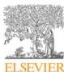
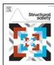

Structural Safety 115 (2025) 102600

Contents lists available at ScienceDirect

Structural Safety

journal homepage: www.elsevier.com/locate/strusafe

# The probabilistic inverse problem and its solving method based on probability density evolution theory and convex optimization algorithms

Yuhan Zhu, Jie Li *

College of Civil Engineering, Tongji University, 1239 Siping Road, Yangpu District, Shanghai, 200092, Shanghai, China

ARTICLE INFO

Keywords:

Probabilistic inverse problem
Probability Density Evolution Theory
Convex optimization

ABSTRACT

A probabilistic inverse problem-solving method based on the framework of Probability Density Evolution Theory and convex optimization algorithms is proposed. This method reformulates the identification of the random source as a quadratic programming problem with linear constraints, identifying the probability density function of the random source in a physical stochastic system even when the distribution type of the random source is entirely unknown. Through singular value decomposition of the quadratic matrix, an error analysis is performed, revealing that the solvability of the probabilistic inverse problem fundamentally depends on the injectivity of the mapping from the random source space to the response space. Case studies confirm that the proposed method is not sensitive to prior information and does not require any predefined assumptions about the distribution type. Meanwhile, it can preliminarily determine whether the inverse problem is solvable before the computational process begins.

1. Introduction

The physical tradition in stochastic dynamical systems focuses on identifying the sources of randomness and analyzing the system from the perspective of random events [1]. It attributes randomness to a set of basic random variables, called the random source, based on physical laws. Stochastic systems modeled in this manner are referred to as physical stochastic systems. Li and Chen [2] introduced the principle of probability conservation, derived the Generalized Density Evolution Equation (GDEE), and developed the Probability Density Evolution Theory (PDEM) to track randomness from the random source to system responses.

One of the core of modeling physical stochastic systems is the identification of the probability density function (PDF) of the random source. In many cases, the PDF of the random source can be obtained through engineering or experimental measurement data statistics, such as the axial compressive strength of concrete. However, some random variables are unobservable, like the damping matrix in an MDOF system or surface roughness in boundary layer models. In such cases, when a system model is first established using physical laws, the unobservable variables should be identified through statistical analysis of observable responses. This leads to the concept of the probabilistic inverse problem: identifying the PDF of the random source from the stochastic response under deterministic test excitations.

System Identification, or inverse problem, refers to inferring unknown deterministic or random parameters of a system from finite-dimensional observations of the system's output variables [3]. Typical methods for solving inverse problems include Bayesian inference and optimization methods [4]. In the Bayesian inference approach, regardless of whether the parameters θ to be identified are random variables, their prior distributions π(θ) can be determined roughly based on engineers' judgment [5–7]. The certain outputs of the system are then specified, forming a vector X that represents the system's state. Subsequently, the system is subjected to n repeated test excitations, and n samples of the state vector X are recorded to form the observation data: D = {x1, x2, ..., xn}. According to Bayes' theorem, the posterior distribution of the parameters is derived:

$$p(\theta|D) = \frac{p(D|\theta)\pi(\theta)}{\int_{\Omega_\theta} p(D|\alpha)\pi(\alpha)\mathrm{d}\alpha} \quad (1)$$

where Ωθ denotes the random source space, p(D|θ) denotes the likelihood function, and p(θ|D) denotes the posterior distribution of θ. The likelihood function quantifies the deviation of observed data from the model's predictions due to model and measurement errors. Let ΩX denote the response space where the state vector X resides. Since the dimension of the joint vector space {ΩX} formed by the observation vectors is much higher than that of the random source space, the probability measure determined by the parameters becomes sharply

* Corresponding author.

E-mail address: lijie@tongji.edu.cn (J. Li).

https://doi.org/10.1016/j.strusafe.2025.102600

Received 12 December 2024; Received in revised form 5 April 2025; Accepted 7 April 2025

Available online 24 April 2025

0167-4730/© 2025 Elsevier Ltd. All rights are reserved, including those for text and data mining, AI training, and similar technologies.