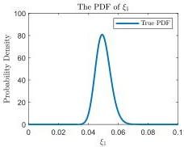
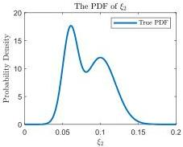
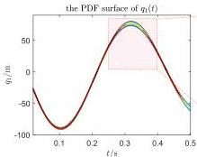
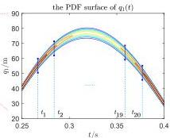
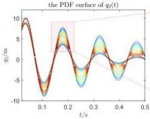
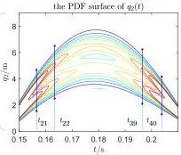

Y. Zhu and J. Li

Structural Safety 115 (2025) 102600

(a)

(b)

Fig. 7. True distributions of the random source.

Fig. 8. The distribution of time instants.

A Monte Carlo numerical simulation is performed with 40,000 iterations, using the same test excitation expressed by Eq. (58), and 40 significant time instants \( t_k, k = 1,2,\dots,N_t = 40 \) are selected as a measured data in applications. These time instants are distributed within one-quarter of a cycle of the first two modal responses during the early stage of the system's evolution which are illustrated in Fig. 8. The absolute displacement samples of each story at all significant time instants \( X_j(t_k), j = 1,2,\dots,40000, k = 1,2,\dots,40 \) are then collected. Subsequently, modal response sample data are generated according to the following method:

\[
\boldsymbol {q} _ {j} (t _ {k}) = \boldsymbol {\Phi} ^ {- 1} \boldsymbol {X} _ {j} (t _ {k}), \quad j = 1, 2, \dots , 4 0 0 0 0, k = 1, 2, \dots , 4 0 \tag {59}
\]

where  \( \Phi = [\varphi_{1}, \varphi_{2}, \ldots, \varphi_{n}] \)  is the mode shape matrix. Kernel density estimation is performed on the data shown in Eq. (59) to generate the truncated probability density of the first two modal stochastic responses at the significant time instants, as illustrated in Fig. 9.

Based on the truncated probability density of the modal random responses at the significant time instants generated by KDE, a random

source identification algorithm is run to identify the damping ratios of the first two modes. Due to the simplicity of the one-dimensional problem, the point set densification step in the algorithm introduced in Section 3.3 is not required, and the Sobol sequence can be replaced with an equidistant distribution of points. The algorithm parameters are shown in Table 2. The variation in \( N_{\mathrm{ad}} \) in Table 2 is due to the reorganization step of the partition point set mentioned earlier. In this example, the number of new points to be added is controlled manually. The number of points \( N_{\mathrm{den}} \) used for the local computation is always kept 50 times the value of \( N_{\mathrm{ad}} \), ensuring that each cell contains 50 densified points. The final results of the algorithm are displayed in Fig. 10. The error between the identification results and the true probability density function of the random source is provided in Table 3. The error is represented in terms of the KL divergence, as shown below: Suppose that \( W \) is a random variable to be identified and let \( p_W, \hat{p}_W \) denote the true PDF and the identification results of the PDF of \( W \), respectively. The KL divergence is defined as follows:

\[
K L _ {\mathrm{f}} = \int_ {\mathbb {R}} p _ {W} (w) \ln \frac {p _ {W} (w)}{\hat {p} _ {W} (w)} \mathrm{d} w \tag {60a}
\]

10