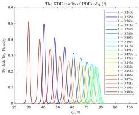
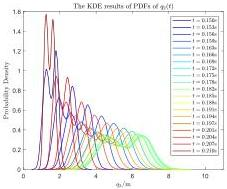
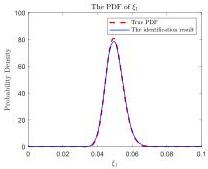
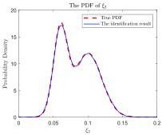

Y. Zhu and J. Li

Structural Safety 115 (2025) 102600

(a)

(b)

Fig. 9. The KDE results of PDFs of modal responses.

(a) The PDF of \(\xi_{1}\)

(b) The PDF of \(\xi_{2}\)

Fig. 10. The identification results.

Table 2
Parameters of the algorithm.

|  Parameters | Values  |
| --- | --- |
|  \( N_{\text{opt}} \) | 3  |
|  \( N_{\text{ad}} \) | [10,20,50]  |
|  \( N_{\text{don}} \) | [500,1000,2500]  |
|  \( n_{\text{apd}} \) | 2  |
|  \( J_{\text{thr}} \) | 1e-5  |
|  h | 1e-6  |

Table 3
Error of the identification results.

|  Error functions | Error in identifying \( \xi_1 \) | Error in identifying \( \xi_2 \)  |
| --- | --- | --- |
|  \( KL_f \) | 0.0394 | 0.0044  |
|  \( KL_b \) | 0.0028 | 0.0016  |

\[
K L _ {\mathrm{b}} = \int_ {\mathbb {R}} \hat {p} _ {W} (w) \ln \frac {\hat {p} _ {W} (w)}{p _ {W} (w)} \mathrm{d} w \tag {60b}
\]

where  \( KL_{f}, KL_{b} \)  denote the forward KL divergence and the backward KL divergence.

The iteration process for calculating the random source probability density functions and the cumulative distribution functions(CDF) as well as the distribution of the partition points and training points in each iteration of the optimization algorithm, are illustrated in Figs. 11 and 12. The comparison between the system's random response truncated probability density, obtained from the random source identification results, and the result estimated using KDE from the observed samples is presented in Fig. 13. The evolution of the objective function \( J(y) \) is illustrated in Fig. 14.

The total computation time was approximately 30 s, including the preparation stage, the optimization stage, and the post-processing stage. As can be seen from Fig. 10 and Table 3, the calculated results of the probability density functions for the first two modal damping ratios deviate slightly from the actual results, with the values of both forward and backward KL divergences reaching the order of  \( 1e-3\sim1e-2 \) . Moreover, the calculation results accurately reproduce the bimodal characteristics of the actual probability density functions, indicating that the algorithm proposed in this paper effectively captures the intricate features of the probability density function shapes.

### 5.2. Identification of Bouc–Wen hysteresis model parameters for nonlinear structures

In this subsection, a numerical example of the identification of an independent multi-dimensional random source is provided. Suppose there exists a frame with the same structural configuration as that illustrated in Fig. 6, where the material elastic modulus of the columns in each layer is \(2 \times 10^{4}\) MPa. The nonlinear behavior of the structure is modeled using the Bouc–Wen interlayer restoring force model, and the evolution relationship between the variables is given by Bouc [55] and Wen [56]:

\[
\left\{\begin{array}{l}g (X, \dot {X}) = \alpha K X + (1 - \alpha) K Z\\Z = \frac {A \dot {X} \rightarrow \left(\hat {\rho} | X Z ^ {n - 1} | Z + \gamma \dot {X} | Z | ^ {n}\right)}{\eta}\\\nu = 1 + d _ {\nu} \varepsilon\\\eta = 1 + d _ {\eta} \varepsilon\\\varepsilon = \int_ {0} ^ {t} Z X \mathrm{d} t\end{array}\right. \tag {61}
\]

11