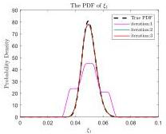
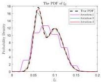
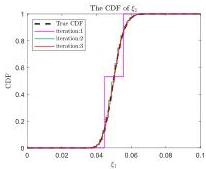
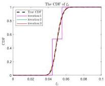
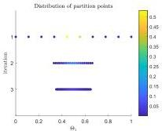
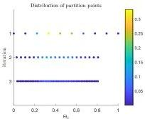
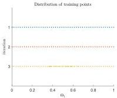
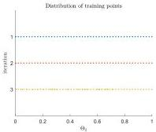

Y. Zhu and J. Li

Structural Safety 115 (2025) 102600

(a) The PDF of \(\xi_{1}\)

(b) The PDF of \(\xi_{2}\)

(c) The CDF of \(\xi_{1}\)

(d) The CDF of \(\xi_{2}\)

Fig. 11. The iteration process of PDFs and CDFs.

(a) The evolution of \(\mathcal{P}_{\mathrm{sel}}\) for \(\Theta_{1}\) (The (b) The evolution of \(\mathcal{P}_{\mathrm{sel}}\) for \(\Theta_{2}\) (The color of points represents values of as- color of points represents values of assigned probabilities) signed probabilities)

(c) The evolution of \(\mathcal{P}_{\mathrm{tr}}\) for \(\Theta_{1}\)

(d) The evolution of \(\mathcal{P}_{\mathrm{tr}}\) for \(\Theta_{2}\)

Fig. 12. The evolution of essential point sets.

12