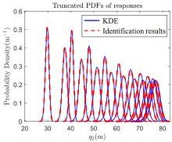
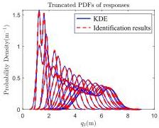
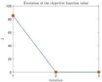
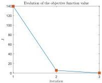

Y. Zhu and J. Li

Structural Safety 115 (2025) 102600

Fig. 13. The comparison of the truncated PDFs of responses.

(a) The evolution of the objective function for identifying \(\xi_{1}\)

(b) The evolution of the objective function for identifying \(\xi_{2}\)

Fig. 14. The evolution of the objective functions.

Table 4
Information of deterministic and random parameters(where m, E, h,  \( \xi_{1} \) ,  \( \xi_{2} \)  denote the mass of each story, the Young's modulus, the height of each story, the first and the second modal damping ratio).

|  Parameters | Is random | Values/Distributions  |
| --- | --- | --- |
|  m | False | \( 1 \times 10^{4} \) kg  |
|  E | False | \( 2 \times 10^{4} \) MPa  |
|  h | False | 4.0 m  |
|  \( \xi_{1} \) | False | 0.05  |
|  \( \xi_{2} \) | False | 0.05  |
|  \( \alpha \) | True | \( Log\mathcal{N}(-3.58, 0.39) \)  |
|  \( \beta \) | False | 60  |
|  \( \gamma \) | False | 10  |
|  \( d_{s} \) | False | 200  |
|  \( d_{d} \) | False | 200  |
|  A | True | \( \mathcal{N}(1, 0.1) \)  |

where  \( g(X, X) \)  represents the interlayer restoring force, and X, Z refers to the real and hysteretic displacements between layers, respectively. The parameters  \( \alpha \)  and A are set as independent random variables, while the remaining parameters are assigned deterministic values.

The damping of the frame is modeled using Rayleigh damping, where the damping matrix is expressed as a linear combination of the mass and stiffness matrices, with the combination coefficients determined based on the first and second-order modal damping ratios of 0.05. The specific values or distribution parameters of all frame parameters are provided in Table 4 and Fig. 15.

The excitation is modeled as an impact applied concentrically at the top of the frame:

\[
\boldsymbol {M} \dot {\boldsymbol {X}} + \boldsymbol {C} \dot {\boldsymbol {X}} + \boldsymbol {G} (\boldsymbol {X}, \dot {\boldsymbol {X}}) = 2 \boldsymbol {M} \boldsymbol {L} g \delta (t), \quad \boldsymbol {L} = (0, 0, \dots , 1) _ {l \times 1 0} ^ {T} \tag {62}
\]

A Monte Carlo numerical simulation is performed with 40,000 iterations, using the same test excitation expressed by Eq. (62), and 10 significant time instants \( t_k \), \( k = 1,2,\dots,N_t = 10 \) are selected to simulate the measured data in applications. 2-dimensional KDE is performed on the data of the displacement of the 10th story \( X_{10}(t) \) and the velocity of the 5th story \( V_5(t) \) to generate the truncated joint probability density functions at the significant time instants, as illustrated in Fig. 16.

Based on the truncated joint probability density of the displacement of the 10th story \( X_{10}(t) \) and the velocity of the 5th story \( V_{5}(t) \) at significant time instants generated by 2-dimensional KDE, a multidimensional independent the random source identification algorithm is run to identify the parameter \( \alpha, A \). The algorithm parameters are shown in Table 5. The variation in \( N_{\mathrm{sel}} \) in Table 5 is due to the densification step and the reorganization step of the partition point set mentioned earlier. In the densification step, the number of new partition points added in each cell is determined by the cell with the highest assigned probability, while the number of points added to other cells is proportional to the ratio of their assigned probabilities to that of the cell with the highest assigned probability. The total number of partition points after addition is automatically calculated by the program. In the reorganization step of the partition point set, the number of partition points will be set to 100 manually. The number of points \( N_{\mathrm{den}} \) used for the local computation is always kept 100 times the value of \( N_{\mathrm{sel}} \), ensuring that each cell contains 100 densified points. The final results of the algorithm are displayed in Fig. 17 and the error in the term of KL divergence between the identification results and the true probability density function is provided in Table 6.

The iteration process for calculating the random source probability density functions and the cumulative distribution functions(CDF) as well as the distribution of the partition points are illustrated in Figs. 18, 19. The evolution of the objective function \( J(y) \) is illustrated in

13