Y. Zhu and J. Li

Structural Safety 115 (2025) 102600

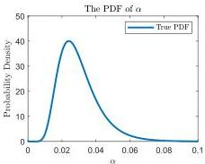

(a)

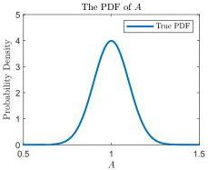

(b)

Fig. 15. The true PDF of the random source.

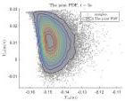

(a)

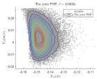

(b)

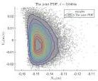

(c)

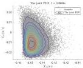

(d)

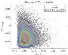

(e)

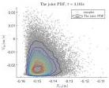

(f)

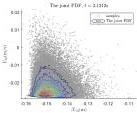

(g)

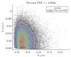

(h)

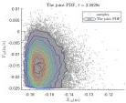

(i)

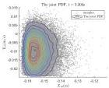

(j)

Fig. 16. The joint PDFs derived from 2-dimensional KDE.

14