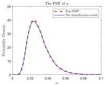
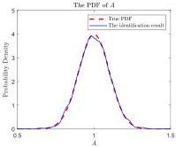

Y. Zhu and J. Li

Structural Safety 115 (2025) 102600

(a) The PDF of \(\alpha\)

(b) The PDF of \(A\)

Fig. 17. The identification results.

Table 5
Parameters of the algorithm.

|  Parameters | Values  |
| --- | --- |
|  \( N_{\text{opt}} \) | 4  |
|  \( N_{\text{ad}} \) | [100,412,100,563]  |
|  \( N_{\text{den}} \) | [1e4,4.12e4,1e4,5.63e4]  |
|  \( n_{\text{opt}} \) | 2  |
|  \( J_{\text{thr}} \) | 1e-5  |
|  h | 1e-6  |

Table 6
Error of the identification results.

|  Error functions | Error in identifying \( \alpha \) | Error in identifying \( A \)  |
| --- | --- | --- |
|  \( KL_{f} \) | 0.0584 | 0.0028  |
|  \( KL_{b} \) | 0.0082 | 0.0033  |

Fig. 20. The truncated joint PDFs of system responses obtained from the random source identification results are presented in Fig. 21.

The total computation time was approximately 667 s. As can be seen from Fig. 17 and Table 6, the calculated results of the probability density functions for  \( \alpha \)  and A deviate slightly from the actual results, with the values of both forward and backward KL divergences reaching the order of 1e-3~1e-2.

## 6. Conclusion and further work

This paper presents a probabilistic inverse problem-solving method based on the probability conservation principle of physical stochastic systems and the theory of convex optimization. It can capture the fine features of the shape of the probability density function of random variables to be identified without requiring the specification of any prior distribution or the type of distribution, only the approximate range of the random source. Moreover, the method is capable of identifying the correlation structure between random variables, as it directly identifies the probability measure of the subsets of the random source space, which means that the joint distribution is directly provided. Additionally, a procedure is proposed to assess the well-posedness of the probabilistic inverse problem based on error analysis theory.

The challenge of the proposed method lies in finding a continuous injective mapping from the random source space to the response space. While increasing the dimension of the response space using large amounts of data of the system's outputs may help find the injective mapping, the probability distribution tends to concentrate on a low-dimensional manifold, leading to numerical singularities in the probability density mentioned earlier. Although the small-sample method proposed in this paper does not rely on increasing the dimension of the response space, thus avoiding the numerical singularities in the probability density, it requires careful determination of the

injective mapping for each specific problem because the dimension of the random source space and the response space is identical. This is why, to date, the work in this paper is limited to low-dimensional random sources. Future work will aim to extend the proposed method to Riemann manifolds to address the identification of higher-dimensional random sources. This approach allows for the construction of injective maps by simply increasing the dimension of the observational data, i.e., the dimension of the response space. Additionally, it enables to capture of the intrinsic manifold structure from noisy data, facilitating the inclusion of measurement error handling.

## CRediT authorship contribution statement

Yuhan Zhu: Writing – review & editing, Writing – original draft, Visualization, Validation, Software, Methodology, Formal analysis, Data curation, Conceptualization. Jie Li: Writing – review & editing, Writing – original draft, Supervision, Resources, Methodology, Investigation, Funding acquisition.

## Declaration of competing interest

The authors declare that they have no known competing financial interests or personal relationships that could have appeared to influence the work reported in this paper.

## Acknowledgments

This work was supported by the National Natural Science Foundation of China (Grant No. 51538010).

## Appendix. Explanations for Proposition 1

Denote the Borel \(\sigma\)-algebra on \(\mathbb{R}^s, \mathbb{R}^d\) by \(B_s, B_d\). The subspace \(\sigma\)-algebra restricted to \(\Omega_\theta\) is defined as \(\Omega_\theta \cap B_s\) on which the Lebesgue measure \(\lambda\) can be well-defined. The explanation of this proposition is divided into two parts. The first part proves that the probability measure \(\operatorname{Pr}_\theta\) on \(\Omega_\theta \cap B_s\) can be uniquely determined by the continuous injection \(G\) and the probability measure \(\operatorname{Pr}_X\) on \(B_d\). The second part demonstrates the existence and the uniqueness of the probability density function \(p_\theta, p_X\) as the Radon-Nikodym derivative of the probability measure \(\operatorname{Pr}_\theta, \operatorname{Pr}_X\) with respect to the Lebesgue measure on \(\Omega_\theta \cap B_s\) and \(B_d\) after including generalized function.

15