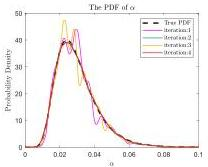
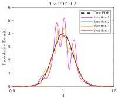
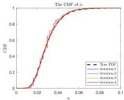
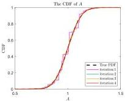
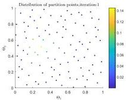
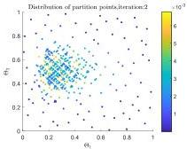
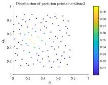
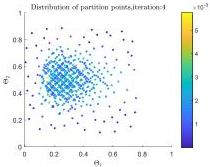

Y. Zhu and J. Li

Structural Safety 115 (2025) 102600

(a) The PDF of \(\alpha\)

(b) The PDF of \(A\)

(c) The CDF of \(\alpha\)

(d) The CDF of \(A\)

Fig. 18. The iteration process of PDFs and CDFs.

(a)

(b)

(c)

(d)

Fig. 19. The evolution of the partition point set (The color of points represents values of assigned probabilities).

16