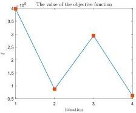

Y. Zhu and J. Li

Structural Safety 115 (2025) 102600

Fig. 20. The evolution of the objective function.

### A.1. The existence and uniqueness of the probability measure

First it is claimed that a probability measure  \( Pr_{\theta} \)  is uniquely determined on  \( \mathcal{G}^{-1}(B_{d}) \)  based on a pushforward measure  \( Pr_{X} \)  on  \( B_{d} \), because if there exists two measure  \( Pr_{\theta,1}.Pr_{\theta,2} \)  on  \( \mathcal{G}^{-1}(B_{d}) \)  inducing the same pushforward measure  \( Pr_{X} \), then for any  \( A \in \mathcal{G}^{-1}(B_{d}) \)  there exists  \( B \in B_{d} \)  such that:

\[
\operatorname * {P r} _ {\boldsymbol {\theta}, 1} (A) = \operatorname * {P r} _ {\boldsymbol {\theta}, 1} \circ \mathcal {G} ^ {- 1} (B) = \operatorname * {P r} _ {\boldsymbol {X}} (B) = \operatorname * {P r} _ {\boldsymbol {\theta}, 2} \circ \mathcal {G} ^ {- 1} (B) = \operatorname * {P r} _ {\boldsymbol {\theta}, 2} (A) \tag {A.1}
\]

Therefore \(\mathrm{Pr}_{\theta,1} = \mathrm{Pr}_{\theta,2}\). Additionally, it can be shown that \(\mathcal{G}^{-1}(B_d) = \Omega_\theta \cap B_s\), then the domain of the measure \(\mathrm{Pr}_\theta\) can be extended from \(\mathcal{G}^{-1}(B_d)\) to \(\Omega_\theta \cap B_s\) where the Lebesgue measure is well defined, thereby allowing the definition of the probability density function. The explanation is as follows.

Let \( T_{s}, T_{d} \) be the topology of \( R^{s}, R^{d} \) induced by Euclidean metric, then the topology of the subspace \( \Omega_{\theta} \subseteq R^{s} \) is defined as \( \Omega_{\theta} \cap T_{s} \). It can be shown that \( \Omega_{\theta} \cap T_{s} \) is the generator of \( \Omega_{\theta} \cap B_{s} \). According to measure theory, the continuity of a function implies its measurability [57], therefore it can be concluded that:

\[
\mathcal {G} ^ {- 1} (T _ {d}) \subseteq \Omega_ {\theta} \cap T _ {s} \rightarrow \mathcal {G} ^ {- 1} (B _ {d}) \subseteq \Omega_ {\theta} \cap B _ {s} \tag {A.2}
\]

It is clear that \(\mathcal{G}\) is a bijection between \(\Omega_{\theta}\) and \(\mathcal{G}(\Omega_{\theta})\). The bounded measurable closed subset \(\Omega_{\theta}\) itself is a compact space and \(\mathcal{G}(\Omega_{\theta})\) is a Hausdorff space as the subspace of \(\mathbb{R}^d\). Point set topology implies that any continuous bijection from a compact space to a Hausdorff space is a homeomorphism [58], which means:

\[
\mathcal {G} (\Omega_ {\theta} \cap T _ {s}) \subseteq \mathcal {G} (\Omega_ {\theta}) \cap T _ {d} \tag {A.3}
\]

That is, for any  \( A \in T_{s} \)  there exists  \( B \in T_{d} \)  such that:

\[
\mathcal {G} (\Omega_ {\theta} \cap A) = \mathcal {G} (\Omega_ {\theta}) \cap B \tag {A.4}
\]

Since \(\mathcal{G}\) is injective, it follows that:

\[
\mathcal {G} ^ {- 1} [ \mathcal {G} (\Omega_ {\theta} \cap A) ] = \Omega_ {\theta} \cap A = \mathcal {G} ^ {- 1} [ \mathcal {G} (\Omega_ {\theta}) \cap B ] = \mathcal {G} ^ {- 1} (B) \in \mathcal {G} ^ {- 1} (T _ {d}) \tag {A.5}
\]

That is to say:

\[
\mathcal {G} ^ {- 1} (T _ {d}) \supseteq \Omega_ {\theta} \cap T _ {s} \rightarrow \mathcal {G} ^ {- 1} (B _ {d}) \supseteq \Omega_ {\theta} \cap B _ {s} \tag {A.6}
\]

In summary,  \( \mathcal{G}^{-1}(B_{d}) = \Omega_{\theta} \cap B_{s} \) . Therefore, a probability measure  \( Pr_{\theta} \)  is uniquely determined on  \( \Omega_{\theta} \cap B_{s} \) .

### A.2. The existence and uniqueness of the probability density function

Suppose there exists a measurable subset \(\Omega\) of a Euclidean space \((\mathbb{R}^n,B_n)\) with a positive Lebesgue measure; then the Lebesgue measure \(\lambda\) can be well-defined on \(\Omega \cap B_{n}\). Denote \(C\) as the function space containing

all the continuous functions with compact support on \(\Omega\). For any \(\varphi \in C\) and any measure \(\mu\) on \(\Omega \cap B_n\), denote \(\mu(\varphi)\) as the following integral:

\[
\mu (\varphi) = \int_ {\Omega} \varphi \mathrm{d} \mu \tag {A.7}
\]

It is clear that the above equation defines a linear functional on \(C\). In addition, the Riesz theorem states that for any continuous linear functional on \(C\), there exists a unique measure such that the expression (A.7) holds [59]. Thus any measure \(\mu\) on \(\Omega \cap B_n\) itself can be regarded as a continuous linear functional on \(C\). Denote \(C'\) as the space containing all the continuous linear functions on \(C\) or all the measures on \(\Omega \cap B_n\).

According to measure theory, for any measure \(\mu\) on \(\Omega \cap B_{n}\) that is absolutely continuous with respect to the Lebesgue measure \(\lambda\), there exists a unique Radon-Nikodym(R-N) derivative \(p\) [57] such that for any \(\varphi \in C\) it is satisfied that:

\[
\mu (\varphi) = \int_ {\Omega} \varphi p \mathrm{d} \lambda = \int_ {\Omega} \varphi (x) p (x) \mathrm{d} x \tag {A.8}
\]

which means \( p(x) \), i.e., the density function, and the corresponding measure \( \mu \) are bijectionally related. Thus the density function \( p(x) \) constructs a continuous linear functional identical to the ones constructed by \( \mu \). Denote \( C_{\mathrm{BC}}' \) as the space containing all the measure on \( \Omega \cap B_n \) which is absolutely continuous with respect to \( \lambda \), and it can be concluded that \( C_{\mathrm{BC}}' \subseteq C' \). It is reasonable to regard \( C_{\mathrm{BC}}' \) as the space containing all the density function \( p(x) \) of an absolutely continuous measure with respect to \( \lambda \) in the sense of a linear isomorphism.

According to the theory of distributions, the definition of a function can be given by its action as a functional on other functions [59]. Therefore, although the measure \(\mu\) in \(C' - C_{\mathrm{BC}}'\) does not have a R-N derivative in the classical sense, the definition of the R-N derivative can be extended to \(C'\), without specifying their explicit expressions (which, in fact, cannot be explicitly given). Formally, the expression (A.8) can still be written. The elements of \(C'\) can be referred to as the generalized R-N derivatives.

The introduction of the generalized R–N derivative allows handling cases where the measure is concentrated on a Lebesgue null set. First, the definition of a measure  \( \mu \)  or its generalized R–N derivative p being zero when regarded as a functional is: for any  \( \varphi \in C' \) , if its support is contained within some open set A, then  \( \mu(\varphi) = 0 \) , and it is said that  \( \mu \)  or p is zero on A. The support of  \( \mu \)  or p is defined as the complement of the largest open set A where  \( \mu \)  is zero. For the case where the measure is concentrated on a Lebesgue null set N, it is clear that for any  \( \varphi \in C' \)  whose support is contained with  \( N^{c} \) , the following holds:

\[
\mu (\varphi) = \int_ {\Omega} \varphi \mathrm{d} \mu = \int_ {N} \varphi \mathrm{d} \mu = 0 \tag {A.9}
\]

Therefore, it is said that the support of p is N, which means p is “zero” on  \( N^{c} \)  and is “non-zero” on N. A widely used example is the Dirac function, which is the generalized R–N derivative of the Dirac measure  \( \delta \)  in Euclidean space. The Dirac measure concentrated at the origin satisfies the following condition:

\[
\delta (\{\mathbf {0} \}) = 1, \quad \delta (A) = 0 \quad \forall A \in B _ {n} \quad \text { s.t. } \quad \mathbf {0} \notin A \tag {A.10}
\]

Combining the concept of the support of a measure and the generalized R–N derivatives leads to the following well-known conclusion regarding the Dirac  \( \delta \)  function, commonly found in scientific papers:

\[
\delta (x) = \left\{ \begin{array}{l l} + \infty , & x = \mathbf {0} \\ 0, & x \neq \mathbf {0} \end{array} \right. \quad \int_ {\mathbb {R} ^ {n}} \delta (x) \mathrm{d} x = 1 \tag {A.11}
\]

In the case where the measure is concentrated on an irregular Lebesgue null set, it is not possible to express such a simplified generalized R-N derivative in a formal manner. Therefore, it is sufficient to declare the existence of its density function in the functional form expressed as Eq. (A.8) without specifying its explicit form.

For any measure \(\mu\) on \(B_{n}\), it can always be decomposed into two parts \(\mu = \mu_{\mathrm{BC}} + \mu_{\mathrm{S}}\) according to the Lebesgue decomposition [57]: \(\mu_{\mathrm{BC}}\) is absolutely continuous with respect to the Lebesgue measure, and

17