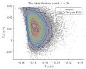
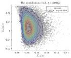
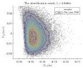
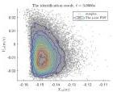
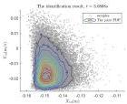
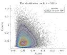
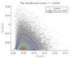
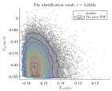
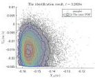
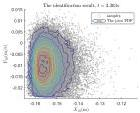

Y. Zhu and J. Li

Structural Safety 115 (2025) 102600

(a)

(b)

(c)

(d)

(e)

(f)

(g)

(h)

(i)

(j)

Fig. 21. The truncated PDFs of responses obtained by identification results.

\( \mu_{s} \) that is mutually singular with respect to it, which means a R–N derivative \( p(\boldsymbol{x}) \) in the classical sense of \( \mu_{sc} \) can be uniquely determined and there exists a measurable set N such that \( \lambda(N)=0 \), \( \mu_{s}(N^{c})=0 \), thus a generalized R–N derivative \( \dot{p}(\boldsymbol{x}) \) supported on N can be uniquely determined.

Through the previous discussion, it can be concluded that the probability density function  \( p_{X}(x) \)  (which may be a generalized function) on  \( R^{d} \)  uniquely determines the probability measure  \( Pr_{X} \)  on  \( B_{d} \), and that by taking this measure as the pushforward under a continuous injection  \( g : \Omega_{\theta} \to R^{d} \), the probability measure  \( Pr_{\theta} \)  on  \( \Omega_{\theta} \cap B_{s} \)  is uniquely determined, which in turn uniquely determines a probability density function  \( p_{\theta}(\theta) \) (which may be a generalized function) on  \( \Omega_{\theta} \).

## Data availability

The data that has been used is confidential.

## References

[1] Li J, Chen J. Stochastic dynamics of structures. John Wiley & Sons; 2009.

[2] Li J, Chen J. The probability density evolution method for dynamic response analysis of non-linear stochastic structures. Internat J Numer Methods Engrg 2006;65(6):882–903.

[3] Nagel JB, Sudret B. Hamiltonian Monte Carlo and borrowing strength in hierarchical inverse problems. ASCE-ASME J Risk Uncertain Eng Syst Part A: Civ Eng 2016;2(3):B4015008.

[4] Ye N, Roosta-Khorasani F, Cui T. Optimization methods for inverse problems. In: de Gier J, Praeger CE, Tao T, editors. 2017 MATRIX annals. Springer; 2019, p. 121–40.

[5] Collins JD, Hart GC, Hasselman T, Kennedy B. Statistical identification of structures. AIAA J 1974;12(2):185–90.

[6] Beck JL, Katafygiotis LS. Updating models and their uncertainties. I: Bayesian statistical framework. J Eng Mech 1998;124(4):455–61.

[7] Guan X, He J, Jha R, Liu Y. An efficient analytical Bayesian method for reliability and system response updating based on Laplace and inverse first-order reliability computations. Reliab Eng Syst Saf 2012;97(1):1–13.

[8] Beck JL, Au S-K. Bayesian updating of structural models and reliability using Markov chain Monte Carlo simulation. J Eng Mech 2002;128(4):380–91.

[9] Hastings WK. Monte Carlo sampling methods using Markov chains and their applications. Biometrika 1970;57(1):97–109.

[10] Ching J, Muto M, Beck JL. Structural model updating and health monitoring with incomplete modal data using Gibbs sampler. Comput-Aided Civ Infrastruct Eng 2006;21(4):242–57.

18