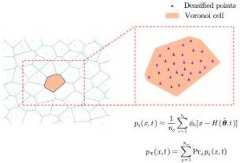

Y. Zhu and J. Li

Structural Safety 115 (2025) 102600

Fig. 1. Partition and densification in the schematic 2-dimensional random source space.

The above algorithm can be extended to higher dimensions. To consider joint probability density  \( p_{X}(x,t) \) , a high-dimensional kernel function can be used to approximate the integration of the high-dimensional  \( \delta \)  function, such as the multivariate Gaussian kernel with a diagonal covariance matrix:

\[
\phi_ {h} (\boldsymbol {x}) = \frac {1}{(2 \pi) ^ {d / 2} \prod_ {i = 1} ^ {d} h _ {i} (t)} \exp \left(- \sum_ {i = 1} ^ {d} \frac {x _ {i} ^ {2}}{2 h _ {i} (t) ^ {2}}\right) = \prod_ {i = 1} ^ {d} \phi_ {h _ {i}} (x _ {i}) \tag {18}
\]

## 3. Theoretical framework of probabilistic inverse problems

### 3.1. Conditions for the uniqueness of solutions to the probabilistic inverse problem

The principle of probability conservation proposed by Li and Chen [1] is essentially the result of transferring the probability measure from an initial measure space to a new space via a measurable mapping. Therefore, the uniqueness of the solution to the probabilistic inverse problem can be determined based on the properties of the mapping. The random source space \(\Omega_{\theta}\) is typically a bounded measurable closed subset of a Euclidean space \(\mathbb{R}^s\), while the response space \(\Omega_X\) is usually taken as a Euclidean space \(\mathbb{R}^d\). In this context, the following proposition can be formulated:

Proposition 1. When there exists a continuous injection \(\mathcal{G}\) from a bounded measurable closed subset \(\Omega_{\theta} \subseteq \mathbb{R}^s\) with positive Lebesgue measure to \(\Omega_X = \mathbb{R}^d\), the probability density function \(p_{\theta}\) on \(\Omega_{\theta}\) can be uniquely determined by \(\mathcal{G}\) and the probability density function \(p_X\) on \(\Omega_X\).

Detailed proof and further explanation can be found in Appendix and only a brief explanation of the proposition is provided here. In simple terms, a measurable mapping from the random source space  \( \Omega_{\theta} \)  to the response space  \( \Omega_{X} \), along with a probability measure  \( Pr_{X} \), can define a unique probability measure on a family of measurable subsets A of  \( \Omega_{\theta} \). However, these subsets in A are too “coarse” to define a probability density, as they lack the fine structure needed for a Radon–Nikodym derivative with respect to the Lebesgue measure in Euclidean space. But if this mapping is a continuous injective function, then sets in A become sufficiently “refined” to define a probability density function.

### 3.2. Formulation of the optimization problem

The probabilistic inverse problem is essentially a best approximation problem that minimizes the discrepancy between the true probability density of the system response and the one calculated using a hypothesized random source distribution. To achieve this, a loss

functional needs to be constructed in the form  \( J(\hat{p}_{\theta}, p_{X}) \)  as the objective function for the optimization problem, where  \( \hat{p}_{\theta} \)  is the hypothesized random source distribution. The probability density of the system response can be approximated as follows based on the random source space partition:

\[
p _ {X} (\boldsymbol {x}, t) = \sum_ {q = 1} ^ {N _ {\mathrm{sel}}} \operatorname * {P r} _ {q} p _ {q} (\boldsymbol {x}, t) \tag {19}
\]

Here, the calculation of \( p_q(x,t) \) is based on Eq. (15).

By adjusting the assigned probabilities  \( Pr_{q} \) , the best approximation to the true probability density of the system response can be achieved. Therefore, the loss functional can be written as a function of the assigned probabilities:

\[
J = J \left(\operatorname * {P r} _ {1}, \operatorname * {P r} _ {2}, \dots , \operatorname * {P r} _ {N _ {\text {sel}}}\right) \tag {20}
\]

From the perspective of functional analysis, if the global probability density function  \( p_{X}(x,t_{k}) \)  and the local probability density function  \( p_{q}(x,t_{k}) \)  at a given time instant  \( t_{k} \)  are viewed as elements of a Hilbert space [51], then each assigned probability corresponds to the projection of the true global probability density onto the local probability density. The Hilbert space is typically infinite-dimensional, with a countable set of basis functions  \( \{e_{i}(x,t_{k}), i \in \mathbb{Z}^{+}\} \) . Consider the decomposition of the functions  \( p_{X}(x,t_{k}) \)  and  \( p_{q}(x,t_{k}) \)  in this basis:

\[
p _ {X} (\boldsymbol {x}, t _ {k}) = \sum_ {i = 1} ^ {\infty} \lambda_ {i} ^ {(k)} e _ {i} (\boldsymbol {x}, t _ {k}) \tag {21a}
\]

\[
p _ {q} (\boldsymbol {x}, t _ {k}) = \sum_ {i = 1} ^ {\infty} \mu_ {i q} ^ {(k)} e _ {i} (\boldsymbol {x}, t _ {k}), \quad q = 1, 2, \dots , N _ {\mathrm{sel}} \tag {21b}
\]

where \(\lambda_i^{(k)},\mu_{iq}^{(k)}\) denotes the expansion coefficients of \(p_X(x,t_k)\) and \(p_q(x,t_k)\). Eq. (19) indicates that:

\[
\sum_ {i = 1} ^ {\infty} \lambda_ {i} ^ {(k)} e _ {i} (\boldsymbol {x}, t _ {k}) = \sum_ {q = 1} ^ {N _ {\mathrm{sel}}} \sum_ {i = 1} ^ {\infty} \operatorname * {P r} _ {q} \mu_ {i q} ^ {(k)} e _ {i} (\boldsymbol {x}, t _ {k}) \tag {22}
\]

This holds if and only if:

\[
\lambda_ {i} ^ {(k)} = \sum_ {q = 1} ^ {N _ {\mathrm{sel}}} \operatorname * {P r} _ {q} \mu_ {i q} ^ {(k)}, \quad \forall i \in \mathbb {Z} ^ {+} \tag {23}
\]

To address practical considerations, a truncation of Eq. (21a) can be performed, replacing \( p_X(x,t_k) \) with a finite-dimensional vector \( f_{k} = (\lambda_1^{(k)},\lambda_2^{(k)},\dots,\lambda_{l_k}^{(k)})^{\top} \). As a result, Eq. (23) can be rewritten as a matrix equation:

\[
\boldsymbol {f} _ {k} = \left\{ \begin{array}{l} \lambda_ {1} ^ {(k)} \\ \lambda_ {2} ^ {(k)} \\ \dots \\ \lambda_ {l _ {k}} ^ {(k)} \end{array} \right\} = \left[ \begin{array}{c c c c} \mu_ {1 1} ^ {(k)} & \mu_ {1 2} ^ {(k)} & \dots & \mu_ {1 N _ {\mathrm{sel}}} ^ {(k)} \\ \mu_ {2 1} ^ {(k)} & \mu_ {2 2} ^ {(k)} & \dots & \mu_ {2 N _ {\mathrm{sel}}} ^ {(k)} \\ \dots & \dots & \dots & \dots \\ \mu_ {l _ {k} 1} ^ {(k)} & \mu_ {l _ {k} 2} ^ {(k)} & \dots & \mu_ {l _ {k} N _ {\mathrm{sel}}} ^ {(k)} \end{array} \right] \left\{ \begin{array}{l} \operatorname * {P r} _ {1} \\ \operatorname * {P r} _ {2} \\ \dots \\ \operatorname * {P r} _ {N _ {\mathrm{sel}}} \end{array} \right\} = \boldsymbol {P} _ {k} \boldsymbol {y} \tag {24}
\]

To avoid Eq. (24) from being underdetermined, it is necessary that  \( l_{k} \geq N_{sel} \) . It is recommended to make the number of truncated terms  \( l_{k} \)  much larger than the total number of subdomains  \( N_{sel} \) . Once the system of Eq. (24) becomes overdetermined, its least-squares solution can be obtained by minimizing the squared residual, leading to the following quadratic optimization function:

\[
J (\mathbf {y}) = \left\| f _ {k} - \boldsymbol {P} _ {k} \mathbf {y} \right\| ^ {2} = \mathbf {y} \boldsymbol {P} _ {k} ^ {\top} \boldsymbol {P} _ {k} \mathbf {y} - 2 f _ {k} ^ {\top} \boldsymbol {P} _ {k} \mathbf {y} + f _ {k} ^ {\top} f _ {k} \tag {25}
\]

As long as the quadratic matrix  \( P_{k}^{T}P_{k} \)  is symmetric and positive definite, the optimization function is strictly convex. Moreover, to improve computational accuracy, it is recommended to consider the global joint probability density over multiple time instants  \( p_{X}(x,t_{k}), k=1,2,\ldots,N_{1} \)  and use the extended vector  \( f_{\mathrm{ex}}=(f_{1}^{\mathrm{T}},f_{2}^{\mathrm{T}},\ldots,f_{N_{1}}^{\mathrm{T}})^{\mathrm{T}} \)  and the extended matrix  \( P_{ex}=[P_{1}^{T},P_{2}^{T},\ldots,P_{N_{1}}^{T}]^{\mathrm{T}} \)  to construct the quadratic form:

\[
J (\mathbf {y}) = \| f _ {\mathrm{ex}} - P _ {\mathrm{ex}} \mathbf {y} \| ^ {2} = \mathbf {y} P _ {\mathrm{ex}} ^ {\top} P _ {\mathrm{ex}} \mathbf {y} - 2 f _ {\mathrm{ex}} ^ {\top} P _ {\mathrm{ex}} \mathbf {y} + f _ {\mathrm{ex}} ^ {\top} f _ {\mathrm{ex}}
\]

4