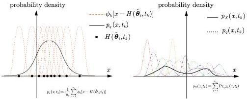

Y. Zhu and J. Li

Structural Safety 115 (2025) 102600

Fig. 2. The composition of the local probability density (left) and the global probability density (right) for one time instant.

\[
= y \left(\sum_ {k = 1} ^ {N _ {k}} P _ {k} ^ {\top} P _ {k}\right) y - 2 \left(\sum_ {k = 1} ^ {N _ {k}} f _ {k} ^ {\top} P _ {k}\right) y + \sum_ {k = 1} ^ {N _ {k}} f _ {k} ^ {\top} f _ {k} \tag {26}
\]

The assigned probabilities are non-negative and satisfy the normalization condition.

Therefore, the complete formulation of the optimization problem is:

min  \( J(y) = y^{\top} A y + b^{\top} y + c \)

s.t.  \( y_{i} \geq 0, i = 1, 2, \ldots, N_{\mathrm{sel}} \)

\[
\sum_ {i = 1} ^ {N _ {\mathrm{sel}}} y _ {i} - 1 = 0 \tag {27}
\]

where \(A = P_{\mathrm{ex}}^{\top}P_{\mathrm{ex}}, b = -2f_{\mathrm{ex}}^{\top}P_{\mathrm{ex}}, c = f_{\mathrm{ex}}^{\top}f_{\mathrm{ex}}\).

Similarly, to ensure that A is symmetric positive definite, the following condition must be satisfied:

\[
\sum_ {k = 1} ^ {N _ {k}} l _ {k} \geq N _ {\mathrm{sel}} \tag {28}
\]

Furthermore, it is recommended that the left-hand side of this equation be much larger than the right-hand side.

In practical computations, the global probability density function and local probability density functions of the system response at multiple time instants are stored as one-dimensional arrays, where the values are taken at discrete points:

\[
\boldsymbol {f} _ {k} = \left(p _ {\boldsymbol {X}} (\boldsymbol {x} _ {1}, t _ {k}), p _ {\boldsymbol {X}} (\boldsymbol {x} _ {2}, t _ {k}), \dots , p _ {\boldsymbol {X}} (\boldsymbol {x} _ {l _ {k}}, t _ {k})\right) ^ {\top} \tag {29a}
\]

\[
\boldsymbol {P} _ {k} ^ {(q)} = \left(p _ {q} (\boldsymbol {x} _ {1}, t _ {k}), p _ {q} (\boldsymbol {x} _ {2}, t _ {k}), \dots , p _ {q} (\boldsymbol {x} _ {l _ {k}}, t _ {k})\right) ^ {\top} \tag {29b}
\]

This process automatically selects an orthonormal basis for the global probability density function at each time instant, as well as for all local response probability density functions:

\[
e _ {1} = (1, 0, 0, \dots , 0) ^ {\top}
\]

\[
e _ {2} = (0, 1, 0, \dots , 0) ^ {\top}
\]

...

\[
e _ {l _ {k}} = (0, 0, 0, \dots , 1) ^ {\top} \tag {30}
\]

Therefore, the coefficient matrix and coefficient vector in the optimization problem (27) can be generated very simply:

\[
\boldsymbol {P} _ {k} = \left[ \boldsymbol {P} _ {k} ^ {(1)}, \boldsymbol {P} _ {k} ^ {(2)}, \dots , \boldsymbol {P} _ {k} ^ {\left(N _ {\mathrm{sel}}\right)} \right] \tag {31a}
\]

\[
\boldsymbol {P} _ {\mathrm{ex}} = \left[ \boldsymbol {P} _ {1} ^ {\top}, \boldsymbol {P} _ {2} ^ {\top}, \dots , \boldsymbol {P} _ {N _ {1}} ^ {\top} \right] ^ {\top} \tag {31b}
\]

\[
\boldsymbol {f} _ {\mathrm{ex}} = \left(\boldsymbol {f} _ {1} ^ {\top}, \boldsymbol {f} _ {2} ^ {\top}, \dots , \boldsymbol {f} _ {N _ {\mathrm{r}}} ^ {\top}\right) ^ {\top} \tag {31c}
\]

\[
\boldsymbol {A} = \boldsymbol {P} _ {\mathrm{ex}} ^ {\top} \boldsymbol {P} _ {\mathrm{ex}}, \boldsymbol {b} = - 2 f _ {\mathrm{ex}} ^ {\top} \boldsymbol {P} _ {\mathrm{ex}}, \boldsymbol {c} = f _ {\mathrm{ex}} ^ {\top} f _ {\mathrm{ex}} \tag {31d}
\]

The structure of  \( f_{ex} \) ,  \( P_{ex} \)  is illustrated in Fig. 3. It can be seen that, in this case, the optimization function in Eq. (27) is essentially the discrete form of the  \( L_{2} \)  norm of the discrepancy between the true PDF of the system response and the identified result.

### 3.3. Identification algorithm

This subsection discusses the identification method for the PDF of a multi-dimensional random source with independent components. The physical stochastic system affected by the s-dimensional random source  \( \xi \in R^{s} \)  can be represented by the following differential equation:

\[
\boldsymbol {Y} = \boldsymbol {A} (\boldsymbol {Y}, \xi , t) \tag {32}
\]

where the components of \(\xi\) are independent of each other. Select several components from the response vector \(Y(t)\) that are more sensitive to changes of \(\xi\), forming the vector \(X(t)\) for computation.

#### Preparation Stage Algorithm:

##### 1. Statistical Estimation:

First, collect multiple samples of  \( \boldsymbol{X}(t_{k}), k = 1, 2, \ldots, N_{\mathrm{t}} \)  at different time instants. Then, perform a multi-dimensional KDE to obtain  \( p_{\boldsymbol{X}}(\boldsymbol{x}, t_{k}) \) . For different time instants, select multiple coordinates  \( \{x_{1}, x_{2}, \ldots, x_{l_{k}}\} \) , and compute the vector  \( f_{ex} \)  using Eqs. (29a) and (31c).

##### 2. Model Training:

An initial hyperrectangle for the random source distribution is provided based on historical experience:

\[
\Omega_ {\xi} = \prod_ {i = 1} ^ {s} [ a _ {i}, b _ {i} ] \tag {33}
\]

Note that the selection of this range can be very coarse and broad, as long as it ensures that the values of the random variable are unlikely to exceed this range. For example, if the compressive strength of a concrete cube is the random variable to be solved, since it is at least a positive number and generally does not exceed 1000 MPa (which is a very weak conclusion), the initial range can be set as [0, 1000] MPa. Define the standardized random variable \(\Theta\) as follows:

\[
\Theta_ {i} = \frac {\xi_ {i} - a _ {i}}{b _ {i} - a _ {i}} \in [ 0, 1 ], \quad i = 1, 2, \dots , s \tag {34}
\]

Then, insert  \( N_{tr} \)  Sobol sequence points within an region slightly larger than  \( [0,1]^{s} \)  to generate a training point set  \( P_{tr} = \{\theta_{1}, \theta_{2}, \ldots, \theta_{N_{tr}}\} \) . For each of these points, solve the differential Eq. (32) to obtain multiple sample trajectories  \( \boldsymbol{H}(\theta_{i}, t_{k}), i = 1, 2, \ldots, N_{tr}, k = 1, 2, \ldots, N_{t} \)  of  \( \boldsymbol{X}(t) \)  and use this data to train a Kriging model at each time instants.

5