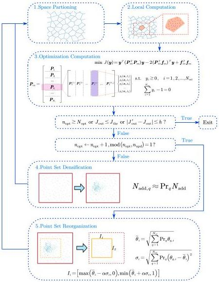

Y. Zhu and J. Li

Structural Safety 115 (2025) 102600

Fig. 4. Diagram of the optimization stage of the independent multi-dimensional random source identification algorithm (The sketches are examples for a 2-dimensional case.).

Subsequently, smoothing and normalization are applied. The result is smoothed using a moving average filter, followed by the necessary corrections to obtain the final computed result:

\[
p _ {i} (\theta_ {i}) = \frac {p _ {i} ^ {\prime} (\theta_ {i})}{\int_ {0} ^ {1} p _ {i} ^ {\prime} (\theta_ {i}) \mathrm{d} \theta_ {i}} \tag {42}
\]

The relationship between original the random source  \( \xi \)  and the standardized random variable  \( \Theta \)  is used to derive the distribution function and probability density function of the original random variable:

\[
F _ {\mathcal {B}, i} (\xi_ {i}) = F _ {i} \left(\frac {\xi_ {i} - a}{b - a}\right) \tag {43}
\]

\[
p _ {\mathcal {B}, i} (\xi) = \frac {1}{b - a} p _ {i} \left(\frac {\xi_ {i} - a}{b - a}\right) \tag {44}
\]

It must be noted that the proposed identification algorithm is not only suitable for the random variables with independent components but also for those with correlated components, because the identification algorithm computes the probability measure of subsets of the

random source space, which means the joint distribution of the random variables is directly provided. To identify random variables with correlated components, it is sufficient to ensure that the rectangular region defined by Eq. (33) contains the region where the probability measure induced by the joint distribution of the random variables is primarily concentrated.

## 4. Error analysis

There exist four types of probability density functions of the system responses  \( \boldsymbol{X}(t) \) :  \( p_{\boldsymbol{X}}^{\mathrm{true}}(\boldsymbol{x},t) \) ,  \( p_{\boldsymbol{X}}^{\mathrm{kde}}(\boldsymbol{x},t) \) ,  \( p_{\boldsymbol{X}}^{\mathrm{par}}(\boldsymbol{x},t) \) ,  \( p_{\boldsymbol{X}}^{\mathrm{opt}}(\boldsymbol{x},t) \) , where  \( p_{\boldsymbol{X}}^{\mathrm{true}}(\boldsymbol{x},t) \)  denotes the true distribution of system responses;  \( p_{\boldsymbol{X}}^{\mathrm{kde}}(\boldsymbol{x},t) \)  denotes the distribution of system responses derived from KDE of the observed samples;  \( p_{\boldsymbol{X}}^{\mathrm{par}}(\boldsymbol{x},t) \)  denotes the computation result of Eq. (19) based on PDEM, where the random source space  \( \Omega_{\Theta} \)  is partitioned into Voronoi cells and the assigned probability  \( Pr_{q} \)  of each cell is calculated based on the true distribution of the random source;  \( p_{\boldsymbol{X}}^{\mathrm{opt}}(\boldsymbol{x},t) \)  is the PDF calculated by Eq. (19) where the assigned probabilities take values of the random source identification results.

7