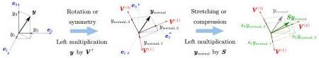
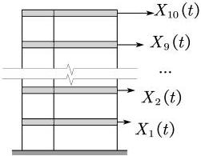

Y. Zhu and J. Li

Structural Safety 115 (2025) 102600

Fig. 5. The effect of \( P_{\mathrm{ex}} \) on \( y \).

the column space's maximal set of linearly independent vectors of \( P_{\mathrm{ex}} \) becoming (or approximately becoming) \( \{U^{(1)}, U^{(2)}, \dots, U^{1/-1}\} \), making the column vectors of \( P_{\mathrm{ex}} \) linearly dependent (or nearly linearly dependent) and leading to the ill-posedness of probabilistic inverse problem. The column vectors represent the local probability densities \( p_0(x, t) \) at different time instants and corresponding coordinate points, and their linear dependence arises from the excessive similarity between the local probability densities of different subdomains. This results from the high overlap of sample trajectories within different subdomains, caused by the non-injective mapping from the random source space \( \Omega_0 \) to the response space \( \Omega_X \).

The orthogonal matrix V in Eq. (54) represents a rotation or symmetry operation to the assigned probability vector y, resulting in another vector  \( y_{normal} = V^{\top}y \)  with the unchanged norm. This can be interpreted as transforming the original coordinate basis into a new one, where the components of  \( y_{normal} \)  represent the normalized coordinates of the assigned probability vector in the new basis. The column vectors  \( V^{(i)} \)  of V represent the new basis vectors. If S contains no zero or near-zero singular value, all components of  \( y_{normal} \) ; retain significant values, fully transmitting probabilistic information of the random source to system responses; otherwise some components of  \( y_{normal} \)  are compressed to zero or nearly zero, causing any variation in the corresponding directions of the normalized basis undetectable on  \( P_{ex} \)  and it is impossible to identify this variation. Fig. 5 illustrates this effect.

It should be noted that in the method proposed in this paper, the model prediction error and the measurement error are incorporated into  \( e^{par} \) ,  \( e^{hde} \)  and  \( e' \) . The impact of these errors on the final results is evaluated through the error analysis formula Eq. (51a). However, no measures were taken to mitigate their effects, making the methods primarily applicable to sufficiently reliable models and sufficiently accurate measurement results.

## 5. Numerical examples

### 5.1. Identification of the stochastic damping matrix for linear structures

In this subsection, a numerical example of the identification of one-dimensional random sources is provided. The equations of motion for a multi-degree-of-freedom (MDOF) linear elastic system subjected to an external excitation  \( F(t) \)  can always be written in the standard form:

\[
\boldsymbol {M} \ddot {\boldsymbol {X}} + \boldsymbol {C} \dot {\boldsymbol {X}} + \boldsymbol {K} \boldsymbol {X} = \boldsymbol {F} (t) \tag {56}
\]

where M, C, and K represent the mass, damping, and stiffness matrices of the system, respectively.

It is well-known that the physical mechanisms of the damping matrix are less understood than those of the mass and stiffness matrices and the random behavior of the damping matrix is a significant factor. The randomness arises from variations in the amount of energy dissipated, the components of dissipation, and the structure's state under each deterministic excitation leading to different observed damping matrix samples. Additionally, discretizing a continuous elastic body into multiple DOFs may introduce other unmodeled sources of randomness. Therefore, modeling a multi-DOF system with a stochastic damping matrix to account for all potential sources of randomness is a reasonable approach.

Fig. 6. The linear frame structure.

Table 1
Information of deterministic and random parameters(where m, E, h,  \( \xi_{1} \) ,  \( \xi_{2} \)  denote the mass of each story, the Young's modulus, the height of each story, the first and the second modal damping ratio. The PDF of  \( \xi_{1} \)  is  \( p_{\xi_{1}}(x) = 0.4\varphi[(x - 0.06)/0.1] + 0.6\varphi[(x - 0.1)/\sqrt{0.02}] \) , where  \( \varphi \)  denotes the PDF of a standard Gaussian random variable.)

|  Parameters | Is random | Values/Distributions  |
| --- | --- | --- |
|  m | False | \( 1 \times 10^{4} \) kg  |
|  E | False | \( 1 \times 10^{4} \) MPa  |
|  h | False | 3.6 m  |
|  \( \xi_{1} \) | True | \( Log\mathcal{N}(=3,0.1) \)  |
|  \( \xi_{2} \) | True | Irregular bimodal distribution  |

Let \(\varphi_{i}, i = 1,2,\ldots,n\) denote the mode shape vector of an n-DOFs system. In this section, the assumption of orthogonal damping is adopted, i.e.,

\[
\boldsymbol {\varphi} _ {i} ^ {\top} \boldsymbol {C} \boldsymbol {\varphi} _ {j} = 0, \quad \forall i \neq j \tag {57}
\]

The method for establishing the stochastic damping matrix in this subsection models the damping ratios of the first two modes as independent random variables. For higher modes, the damping ratios are modeled according to the approach proposed by Clough and Penzien [54].

Fig. 6 illustrates a 10-story, two-span shear frame structure. The mass of each story is \(1 \times 10^{4}\) kg, the material Young's modulus of the frame columns is \(1 \times 10^{4}\) MPa, the cross-sectional area is \(500\mathrm{mm} \times 400\mathrm{mm}\), and the story height is \(3.6\mathrm{m}\). The beam stiffness is assumed to be infinite. The damping ratios for the first two modes are modeled as independent random variables following different distributions. The damping ratio of the third mode is set to 0.1, and for higher modes, the damping ratios are assumed to be proportional to the corresponding modal natural frequencies, maintaining the same ratio as that of the third mode. The deterministic parameters and random variables are shown in Table 1. The true distributions of the random source are illustrated in Fig. 7.

The test excitation is set as an impact excitation distributed according to mass, with an intensity equal to the magnitude of gravitational acceleration  \( g \approx 9.8 \, m/s^{2} \) . The governing equations of the system are given by:

\[
\boldsymbol {M} \ddot {\boldsymbol {X}} + \boldsymbol {C} \dot {\boldsymbol {X}} + \boldsymbol {K} \boldsymbol {X} = \boldsymbol {M} \boldsymbol {L} g \dot {\boldsymbol {o}} (t), \quad \boldsymbol {L} = (1, 1, \dots , 1) _ {1 \times 1 0} ^ {\top} \tag {58}
\]

9