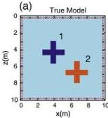
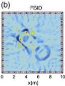
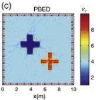
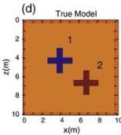
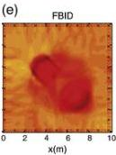
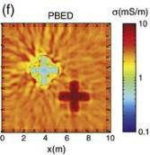
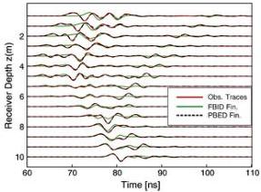

40

G. Meles et al. / Journal of Applied Geophysics 78 (2012) 31–43

Fig. 9. (a) Permittivity and (d) conductivity distributions for the second synthetic model experiment involving two anomalous cross-shaped inclusions of low and high permittivity and conductivity in a uniform intermediate background. The "x" and "o" symbols stand for transmitters and receivers employed in the 4-sided experiment. The results of FBID inversion applied to the noise-free traces are shown in (b) and (e), whereas those of PBED inversion are shown in (c) and (f).

particularly good (Fig. 9c), whereas the conductivity image is somewhat contaminated by small-scale fluctuations, especially around the low conductivity feature (Fig. 9f). The data misfit corresponding to the final PBED inverted model is about 20% of that for the final FBID inverted model.

A selection of radargrams for the source at 5.3 m depth in one borehole and receivers in the opposite borehole is shown in Fig. 10. The colour coding is the same as for Fig. 8. The match between the black and red traces is again very good, much better than that between the green and red ones, demonstrating the clear superiority of the PBED over the FBID inversion results. What is especially impressive is the close match of the black and red traces along their entire lengths, including the back-scattered and reflected signals from the two crosses. The FBID scheme fails to fit the weaker later reflected arrivals, which are particularly diagnostic of the presence of the anomalous bodies.

### 5.3. Model 3—composite double embedded high and low permittivity/conductivity blocks in a homogeneous background

Model 3 is even more complex and challenging (Fig. 11). It includes two squares enclosed in two larger squares. The pairs of squares have different dimensions. The inner squares of the pairs have a relative permittivity εr=1 and a conductivity σ=0.1 mS/m, whereas the outer squares have εr=8 and σ=10 mS/m. The homogeneous background medium has εr=4 and σ=3 mS/m (Fig. 11a and f). The contrasts are again very large. For this model, the mutual interaction of the embedded inclusions is predominant in most of the traces (not shown).

The data were generated using the same recording geometry as for model 1 and inverted using the standard FBID and the new PBED schemes. Despite the size of the anomalous blocks involved, the time-shift differences between the traces are small compared to the critical value (i.e., half the dominant period) because of the compensating effects of the high and low permittivities (i.e., low and high velocity anomalies). Fig. 11b and g show the final FBID inversion results. The

conductivity image contains the correct relative features, but the permittivity image is seriously distorted. In fact, it appears as an indistinct slightly higher permittivity feature with no evidence for the central high. The inversion was repeated (not shown) using the traveltime tomogram as the starting model, but no improvements were observed. These double high/low permittivity (low/high velocity) blocks are slightly high permittivity (low velocity) features in the traveltime tomogram and are never updated in the right direction during the FBID inversion. This is an example where despite the time shifts between the observed and starting model being less than half the period (the necessary condition mentioned in

Fig. 10. For model 2, radargrams for a source at 5.3 m depth in the left borehole and all receivers in the right borehole of Fig. 9. Results are given for the observed traces (red), initial model using traveltime tomography (blue), final model obtained by FBID inversion (green) and final model obtained by PBED inversion (black). A time-variant gain has been applied, along with trace normalization. Note the excellent agreement between the red and black curves (they mostly overlap), including for the later scattered/reflected signals, whereas the green traces do not match the observed data nearly as well.