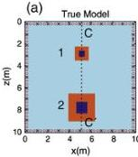
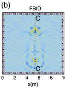
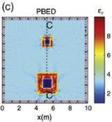
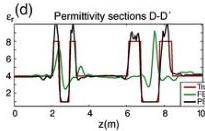
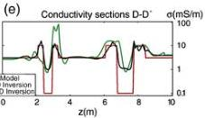
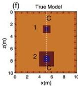
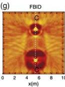
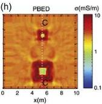

G. Meles et al. / Journal of Applied Geophysics 78 (2012) 31–43

41

Fig. 11. Model 3 synthetic experiment (a) and (f), involving two composite embedded high permittivity/high conductivity blocks of different sizes, each having their own inclusion of low permittivity/low conductivity material. Crosses and circles represent the sources and receivers employed in the 4-sided experiment. The results of FBID inversion applied to the noise-free traces are shown in (b) and (g), whereas those of PBED inversion are shown in (c) and (h). Permittivity cross sections along line CC' are shown in (e) and conductivity cross sections along the same line are shown in (e). Note how the inner inclusions have been recovered in (c) and (h).

Section 5.1.1), it is not sufficient to prevent the FBID inversion from failing.

Application of PBED inversion (Fig. 11c and h) yields high resolution images of both the inner and outer squares, with sharp boundaries in both the permittivity and conductivity displays. The inner square relative permittivity of 1 (air) is fully recovered. We also show vertical cross sections CC' passing through the two bodies as Fig. 11d and e. They highlight the close fit in the model space between the true and inverted distributions for PBED. In contrast, the fit is quite poor for the FBID inversion, with neither the shapes nor the magnitudes of the anomalies being properly recovered.

The radargrams for the final PBED model (not shown) match the observed data closely, with the later arriving scattered signals being correctly predicted (e.g., as for model 2 in Fig. 10). The new PBED method not only yields a good fit in the model space but also in the data space.

### 5.4. Model 4–layered model with stochastic fluctuations and multiple embedded low permittivity and low conductivity

Our final model (Fig. 12a and e) is more realistic and complicated than the previous ones, presenting a major challenge for full-waveform tomography. It comprises a three layer structure of contrasting permittivities and conductivities with superimposed

stochastic variations and multiple inclusions bodies of low permittivity ($\varepsilon_r=1$; high velocity) and low conductivity ($\sigma=0.1$ mS/m) located within the middle layer. The physical property contrasts of the inclusions are again very large and expected to create major difficulties (non-linearity issues) for most inversion schemes. The three small inclusions are sub-wavelength in dimension, whereas the larger one is not, but its size and large velocity contrast with the background means that significant time differences are expected to exist between the observed data and that computed for the starting model for paths that intersect the anomaly. A somewhat similar 3-layered model was investigated by Ernst et al. (2007a) and Meles et al. (2010), but it comprised inclusions of high permittivity/high conductivity, the latter being less challenging for GPR inversion. In this example, the borehole depths are 20.6 m and there are 10 source positions (crosses in the figure) and 10 receiver positions (circles in the figure) in each borehole, with an additional 5 sources along both the top and bottom edges of the model. The receivers surround the model on all four sides, with 80 receivers located in each borehole and 40 along the top and bottom of the model. The permittivity image that results from application of the FBID inversion scheme reveals some of the small inclusions not seen in the ray-based image and is therefore a slight improvement over that provided by traveltime tomography (compare Fig. 12b with Fig. 12c). However, both the ray-based and the FBID inversion schemes produce very poor