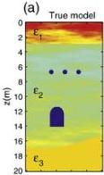
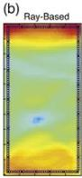
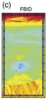
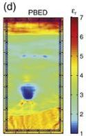
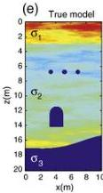
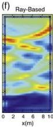
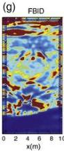
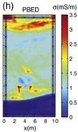

42

G. Meles et al. / Journal of Applied Geophysics 78 (2012) 31–43

Fig. 12. (a) Relative permittivity and (e) conductivity distributions for Model 4. The resulting tomograms obtained by applying travel time and amplitude tomography are shown in (b) and (f). Diagrams (c) and (g) give the relative permittivity and conductivity tomograms after applying FBID inversion, while (d) and (h) are the companion tomograms obtained by applying PBED inversion. The PBED images are a significant improvement over FBID using TTT as the starting model.

conductivity images (Fig. 12f and g), with the FBID result showing more artefacts.

The full-waveform PBED algorithm does a much better job in recovering the shapes and permittivities of the inclusions (Fig. 12d), but the conductivity image (Fig. 12h) is less than ideal, primarily because the anomalies are small and of low conductivity (loss of sensitivity). Nevertheless, it is a considerable improvement over the FBID conductivity inversion result.

## 6. Conclusions

We have presented a new full-waveform time-domain inversion scheme for GPR data based on a gradual and progressive expansion of the frequency content (starting at low frequency), as the iterations proceed. It is designed to tame the non-linearity problem that bedevils most inverse scattering problems, especially when the target contrasts are large. The performance of the new algorithm has been compared to that of our state-of-the-art scheme that inverts the full bandwidth data set from the first inversion stages. The synthetic results shown here clearly demonstrate that the new scheme can markedly improve the quality of the inversion results, largely avoiding local minima and strong artefacts in the permittivity and conductivity images. These results suggest that an approach solely based on full-waveform time-domain analysis is too unstable for many models that include high physical property contrasts.

The next steps will be to examine the behaviour of the new inversion algorithm on data contaminated by noise, both white and coloured, and to apply it to real data.

## Acknowledgements

This work was supported by grants from ETH Zurich and the Swiss National Science Foundation. We benefited from stimulating discussions with Dr Jacques Ernst and are indebted to Anja Klotzsche for providing the traveltime tomography starting models for some waveform inversions. We thank Dr Thomas Hansen and an anonymous reviewer for their helpful and insightful reviews of the paper.

## References

Carlsten, S., Johansson, S., Worman, A., 1995. Radar techniques for indicating internal erosion in embankment dams. J. Appl. Geophys. 33, 143–156.

Charara, M., Barnes, C., Tarantola, A., 1996. The state of affairs in inversion of seismic data: An OVSP example, 66th Ann. Internat. Mtg. Soc. Expl. Geophys., 1999–2002.

Charara, M., Barnes, C., Tarantola, A., 2000. Fullwaveform inversion of seismic data for a visco-elastic medium. Methods and Applications of Inversion, Lectures Notes in Earth Sciences, 92. Springer-Verlag, New York.

Chew, W.C., Wang, Y.M., 1990. Reconstruction of two-dimensional permittivity distribution using the distorted Born iterative method. IEEE Trans. Med. Imaging 9, 218–225.

Chew, W.C., Lin, J.H., 1995. A frequency-hopping approach for microwave imaging of large inhomogeneous bodies. IEEE Microwave Guided Wave Lett. 5, 439–441.

Clement, W.P., Barrash, W., 2006. Crosshole radar tomography in a fluvial aquifer near Boise, Idaho. J. Environ. Eng. Geophys. 11, 171–184.

Claerbout, J., 1985. Imaging the Earth's Interior. Blackwell Publishers.

Dubois, A., Belkebir, K., Catapano, I., Saillard, M., 2009. Iterative solution of the electromagnetic inverse scattering problem for the transient scattered field. Radio Sci. 44 (RS1007).

Ernst, J., Maurer, H., Green, A.G., Holliger, K., 2007a. Full-waveform inversion of crosshole radar data based on 2-D finite-difference time-domain (FDTD) solutions of Maxwell's equations. IEEE Trans. Geosci. Remote Sens. 45, 2807–2828.

Ernst, J., Green, A.G., Maurer, H., Holliger, K., 2007b. Application of a new 2-D time-domain full-waveform inversion scheme to crosshole radar data. Geophysics 72, J53–J64.