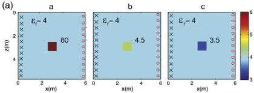
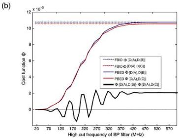

G. Meles et al. / Journal of Applied Geophysics 78 (2012) 31–43

33

this inversion scheme that leads to an entirely new approach to waveform tomography, which forms the subject matter and purpose of the rest of the paper.

# 2.1. Gradient-based full-waveform time-domain inversion

The inversion algorithm of Meles et al. (2010), which is based on a vector formulation and solves for the εr and σ distributions simultaneously, uses a gradient-type iterative scheme that for every iteration computes the cost function gradients and updates the model along them by defined step lengths. Because the entire frequency content of the data is used from the very first iteration, we refer to this inversion scheme as full bandwidth initial data, or FBID.

The inversion algorithm includes the following steps:

1) Determine a good initial input model using an inexpensive inversion scheme (e.g., traveltime tomography or a plausible homogeneous distribution).
2) Based on this initial model, simulate data at each receiver location for every transmitter position and calculate the misfit with the observed data (1st calculation of the forward problem).
3) Back-propagate the misfit wavefield and cross-correlate the results with the forward-propagated electric fields to yield the εr and σ gradients of the cost function (2nd calculation of the forward problem).

4) Estimate the εr and σ step lengths used to move along the gradient directions until a local minimum is found (3rd and 4th calculations of the forward problem).
5) Update the model parameters according to the computed gradients and step-lengths.
6) Repeat the inversion scheme until convergence to a pre-defined cost function minimum is achieved.

Mathematical details of the above-mentioned inversion algorithm, including all essential equations for calculating gradients and step lengths, as well as information on its computational costs and applications to synthetic data, can be found in Meles et al. (2010). Inversion of an observed data set using this algorithm is given in Klotzsche et al. (2010).

# 2.2. Spectral coverage and stability

Under the assumption of weak scattering and crosshole recording, it is possible to identify the area of spatial wavenumber coverage in the model space from a single frequency source (Mora, 1989; Wu and Toksoz, 1987). It is known that the higher the frequency content of the source, the better the coverage in the spatial wavenumber domain. However, the assumption of weak scattering is rarely valid and more often, especially at the very early stages of inversion, instability may occur because of the large differences between the true and the current

Fig. 1. (a) Three models A, B and C comprising a single embedded block of identical size and position but of different anomalous permittivity values (εr = 80, 4.5 and 3.5 respectively) set within a uniform background of εr = 4. Conductivity σ is constant for all models at 0.1 mS/m. A synthetic crosshole radar synthetic experiment involving the transmitters (shown by crosses) and receivers (shown by circles) is performed for all three models to generate three data sets D(A), D(B) and D(C). (b) The data sets are successively filtered with increasing bandwidth and the data misfits (cost functions) Φ between the model pairs A and B, and A and C are plotted as a function of the high frequency limit of the filter (solid blue and red curves). The differences between the two curves, amplified by a factor of 10, are plotted as the thick black curve. The dashed blue and red horizontal curves along the top represent the data set differences for the full bandwidth data. The trend of the misfit in the data space is the same as the trend in the model space only for low frequency components of the data sets (i.e., negative values of the thick black curve).