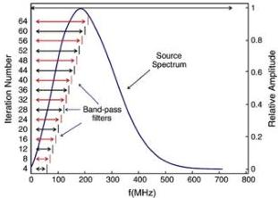

34

G. Meles et al. / Journal of Applied Geophysics 78 (2012) 31–43

model, with the result that the inversion fails to converge to the true solution. This is usually associated with cycle-skipping, in the sense that the time difference between the observed and the synthetic data is larger than half the period. This phenomenon is obviously more severe for high frequencies than for low frequencies. In the next section, we provide an example of a realistic problem that can be encountered when inverting radar traces collected in standard configurations.

### 2.3. Non-linearity of the forward problem

We present here a very simple example of instability related to the non-linearity of the forward problem. Fig. 1a shows models A, B and C. All three models involve a square anomaly of identical shape but different relative permittivity ($\varepsilon_r = 80, 4.5$ and $3.5$ for models A, B and C, respectively), embedded in an identical homogeneous background of relative permittivity $\varepsilon_r = 4$. The conductivity is assumed to be uniform ($\sigma = 1$ mS/m) for the 3 models. Note, that model C is more distant (different) from model A than is model B.

For the same crosshole recording configuration (crosses and circles in Fig. 1a), we compute sets of synthetic radar traces for all models. These data sets are referred to as D(A), D(B) and D(C). The effective source pulse for this and other synthetic data sets presented in this paper is a differentiated Gaussian of bipolar form, having an asymmetric bell-shaped amplitude spectrum from 5–600 MHz with a dominant frequency of ~200 MHz (see Fig. 2). It yields a dominant wavelength of ~0.75 m in the background medium of the models in Fig. 1. We now compute the misfit-cost functions

$$\Phi = \sum_i [D_i^A - D_i^B]^2. \tag{1}$$

with j = B or C, as the squared norm of the data differences for all samples i between models A, B and C, treating model A as the reference or true model and models B and C as possible updated models. Despite model B being closer than model C to model A in the model space, D(C) is closer than D(B) to D(A) in the data space. This is illustrated schematically towards the top of Fig. 1b by the horizontal dashed blue and red lines, which represent the respective misfits $\Phi[D(A), D(B)]$ and $\Phi[D(A), D(C)]$ of $10.7 \times 10^{-6}$ and $10.5 \times 10^{-6}$, respectively for the full bandwidth data (these values really only apply for the far right end of the diagram, but are shown over the whole frequency range simply for readability purposes). Due to the highly non-linear nature of the forward problem, the trend of the

Fig. 2. Source spectrum and the different band-pass filters (shown schematically by the black and red horizontal bars) applied to the signal as iterations proceed, starting at low frequency and gradually expanding the bandwidth (after every 4th iteration) by increasing the high cut corner frequency. After the centre frequency of 200 MHz is reached, all subsequent iterations use the full bandwidth of the data.

misfit in the data space is opposite to the trend of the misfit in the model space. This can be critical in an actual inversion. It may happen, for example, that during the first iterations, the gradient detects the shape of the anomaly, but because the step-length updates the model in the wrong direction, the anomaly is mapped as a low permittivity feature when it should be high permittivity. This would occur because the step-length is determined by minimizing the cost function along the gradient direction of the data misfit.

### 3. Taming the non-linearity problem in full-waveform inversion

In our previous full-waveform inversion approach, as described in Section 2.1, the entire frequency content of the data is used from the very first iteration to update the model, but in our new approach (referred to as progressive bandwidth expansion of data, or PBED) we progressively increase the frequency content (starting at a low frequency) as the iterations proceed. This involves bandpass filtering the original radargrams in gradual steps, and successively expanding the bandwidth.

A somewhat similar frequency selection approach is often used in microwave inverse scattering, where it is referred to as the frequency hopping method (Chew and Lin, 1995) which does not use cumulative frequencies (actual frequency bands), just one frequency at a time. Similarly, in Gauss–Newton frequency-domain seismic inversion (Maurer et al., 2009; Pratt et al., 1998; Sirgue and Pratt, 2004), only a small number of well chosen single frequencies are used, one at a time.

To support our argument for the proposed approach, we present in Fig. 1b an elaboration of what was discussed in the previous section. For the full bandwidth data set depicted in the upper far right of the curves, the distance between D(A) and D(B) (here shown as a constant value along the whole frequency range—the dashed dark blue line) is larger than that between D(A) and D(C) (the dashed red line). This means that despite being further away from the true solution in the model space, the difference between the radargrams (data space) for the full bandwidth data is actually less and there is an opposite trend between the data space and the model space. Such non-linearity is characteristic of many geophysical forward problems.

To overcome this non-linearity, we progressively filter the data with a simple bandpass filter, keeping the low cut frequency at 10 MHz and allowing the high-cut frequency to gradually grow in increments of 10 MHz until the maximum frequency of 600 MHz is reached.

The differences of the filtered datasets D(B) and D(C), relative to D(A), are shown in Fig. 1b as the solid blue and solid red lines, respectively. The thick black line drawn at the bottom of the diagram is an amplification, by a factor 10, of the differences between the blue and the red lines. Note the oscillatory nature of the differences. For broad-band data, the difference curve is uniformly positive, meaning that there is a larger difference in the data cost functions for models A and B than for models A and C. This shows that there is an opposite trend between the data space and the model space. But when only the low frequency data are used (i.e., 10–90 MHz), the data misfit is entirely negative, meaning that the data for model B is closer to the data for model A than is the data for model C. This indicates that the trend in the data space is the same as the trend in the model space.

Thus, for the specific inverse problem under consideration here when working with low frequency data, iterative updates in the $\varepsilon_r$ value of the anomalous block will be in a direction towards the true solution, corresponding to a reduction in the data misfit. For this reason, we expect the inversion to avoid getting trapped in local minima if we invert, at least during the early steps of the inversion, only the low frequency content of the data.

### 3.1. An illustrative example of a one-parameter inversion

We now consider in more detail a simplified one-parameter inversion problem in the context of the model presented in Fig. 1a. Let