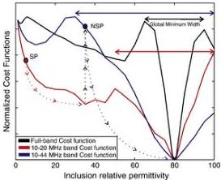

G. Meles et al. / Journal of Applied Geophysics 78 (2012) 31–43

35

A and D(A) be the true model and the synthetically generated “observed” traces for this model. We invert only for the εᵣ value in the anomalous block by assuming that we know its location and shape. Because only one parameter can be updated, the problem is a one-parameter inversion. Fig. 3 shows the cost functions of this problem for different data sets. The black curve corresponds to the cost function for the entire full bandwidth dataset. Local minima occur at εᵣ values of about 2, 55, 80 and beyond 95. The global minimum (true solution) occurs at the correct value of 80. As a consequence, in order to avoid getting trapped in a local minimum, the inversion should start with a model block εᵣ value somewhere between 65 and 95. The red and light blue curves correspond to cost functions for which 10–20 MHz and 10–44 MHz bandpass filters are applied to the datasets, respectively. Whereas the red and the blue curves also exhibit local minima, the width of each global minimum is much broader in terms of the model (permittivity) values. Local minimum trapping can be avoided by successively using these two data sets. For example, if we start with εᵣ=4 for the anomalous body (corresponding to a homogenous starting model equal to the background medium), by using the 10–20 MHz data set, we would reach the local minimum at εᵣ~35. Then, by starting the next phase of the inversion at this εᵣ value and using the 10–44 MHz dataset, we would finally and rapidly reach the global minimum at εᵣ=80. This simple example, far from demonstrating and establishing a general methodology, suggests a different approach to inversion in which different frequency contents of the data are used at different stages of the inversion. The key is to start at low frequency, where stability is more likely, and gradually add the higher frequency components of the data as iterations proceed. Because low-frequency content data are inverted first, the relative importance of the starting model is much diminished.

### 4. A new frequency-time-domain full-waveform inversion scheme

Following the ideas presented in the previous section, the original FBID algorithm of Meles et al. (2010; Fig. 4a) is modified as follows (Fig. 4b):

1) Determine a good initial input model using an inexpensive inversion scheme (e.g., traveltime tomography or even a homogenous model).

Fig. 3. Cost functions for data sets simulated for the configuration presented in Fig. 1a. The true data set D(A) is compared with data sets computed for different values assigned to the inclusion permittivity εᵣ. The data sets are then filtered and the misfits displayed as a function of εᵣ. The black curve corresponds to the full bandwidth data, whereas the red and blue curves correspond to band-pass filtered data in the ranges 10–20 MHz and 10–44 MHz, respectively. Trapping in local minima can be avoided and the true solution reached by combining the different data sets, starting at the point SP (homogeneous model) with the 10–20 MHz data until the first local minimum is reached (see dotted curve), then jumping to the new start point (NSP) and using the 10–44 MHz data to arrive at the global minimum.

2) Based on this initial model, compute the frequency-filtered data at each receiver location and calculate the misfit with the observed data (1st calculation of the forward problem).
3) Back-propagate the misfit or residual wavefield and cross-correlate the results with the filtered forward-propagated electric field to yield the εᵣ and σ gradients of the cost function (2nd calculation of the forward problem). Due to the orthogonality properties of the Fourier base, the residual fields do not need to be filtered (any frequency component not common to both data sets—forward and back-propagated residual—will be eliminated in the cross-correlation process).
4) Estimate the step lengths required to move along the gradient directions until a local minimum is found (3rd and 4th calculations of the forward problem).
5) Update the model parameters according to the computed gradients and step-lengths.
6) Repeat the inversion scheme, updating the frequency content of the data at specified intervals. This part of the scheme is illustrated schematically in Fig. 2, which shows the source signal and the bandpass filter applied to it at various stages. The bandwidth is expanded progressively by increasing the high cut frequency in fixed increments and keeping the low cut frequency constant. When the high cut frequency reaches the central frequency of the source pulse, stability is likely because any time shifts between the observed and computed data for the current model will be less than half a period. So, for all remaining iterations the full bandwidth of the data can be used.
7) Once the full frequency content of the data is inverted, repeat the inversion until convergence is reached.

Following Pica et al. (1990), we have introduced dynamic scaling of the perturbation factors as inverse functions of the maximum magnitudes of the gradients. This was needed to provide proper linearization for the determination of the step-lengths (see Meles et al. (2010) for more details). The amplitudes of the gradients can vary by several orders of magnitude during the inversion process due to the different frequency contents of the data and the convergence in the data space at different stages of the PBED. The perturbation factors need to be adjusted to compensate for this effect.

The new scheme retains all of the equations described by Meles et al. (2010). The essential and distinguishing feature of the new PBED scheme is that it exploits a range of imaging wavelengths in a controlled manner. Because the medium comprises inhomogeneities of various sizes (and contrasts), from quite small to moderately large (relative to each wavelength), it can be more effectively sampled and interrogated by multiple wavelengths in each expanded frequency band sequentially.

### 5. Synthetic data inversion tests

In this section, we compare the results of applying the FBID and PBED inversion schemes to a number of synthetic examples. The 2D TM mode input data (with the electric field in the plane of the section) are simulated using a FDTD algorithm and inverted on a cluster of computers. To ensure stability and avoid numerical grid dispersion in our simulations, we had to consider the medium properties and the frequency content of the source(s) in setting the grid spacing and time steps. In all synthetic tests, we employ an optimal recording configuration, with sources and receivers placed along all four sides of the model domain. Although uncommon in GPR, such geometries are possible at a mine site, for example, where two tunnels at different depths or positions are linked by two vertical or horizontal boreholes. The choice of such good target coverage was driven by our intention to provide the best possible configuration for both inversion schemes. Our goal is to demonstrate that the limitations of current FBID methods (Ernst et al., 2007a, b; Meles et al., 2010) are not associated with limited target coverage provided by conventional crosshole recording configurations, but rather, are