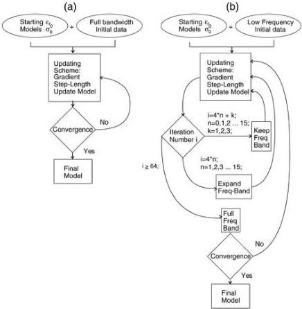

36

G. Meles et al. / Journal of Applied Geophysics 78 (2012) 31–43

Fig. 4. Flow diagrams for the (a) current FBID and (b) new PBED inversion algorithms. The new scheme starts with low frequency data, expands the bandwidth after every 4th iteration, finally moving to the full bandwidth data after 64 iterations (i.e., when the central frequency of the source pulse is reached).

symptoms of an intrinsic problem. Furthermore, standard crosshole data sets satisfactorily inverted with the original FBID scheme (i.e. for models having only small contrasts, and hence less afflicted by non-linearity issues) were also inverted with the new PBED algorithm. In these cases, the new PBED method showed only minor improvements over the existing FBID scheme (results not shown here for space economy). The main benefits of PBED are in dealing with high contrast media.

### 5.1. Model 1—small and large block inclusions of high/low permittivity and conductivity

With our first synthetic example (Figs. 5a, 6a and g), we wish to express the non-linearity problem in terms of time shifts between the “observed” radar data (i.e., that computed for the true model) and radargrams computed for the starting model. We consider two square permittivity/conductivity inclusions embedded in a homogeneous background medium. The size of the larger low permittivity low conductivity body ($\varepsilon_r = 1$ and $\sigma = 0.1$ mS/m) is $120 \times 120$ cm, whereas that of the smaller high permittivity high conductivity body ($\varepsilon_r = 8$ and $\sigma = 10$ mS/m) is $30 \times 30$ cm. The dominant wavelengths within the background medium ($\varepsilon_r = 4$, $\sigma = 3$ mS/m) and the larger block are -0.75 and 1.5 m, respectively. Therefore, even the larger inclusion is of sub-wavelength dimension. The synthetic data were generated using 10 sources and 30 receivers placed along each side of the model of dimensions $10.6 \times 10.6$ m (shown by crosses and circles in the plots, respectively).

### 5.1.1. Starting models

Uniform distributions of $\varepsilon_r$ and $\sigma$ values were used as starting models for the new PBED scheme, whereas for the FBID inversion, the

model obtained from traveltime tomography was also tested. In Fig. 5, we show the differences between traces corresponding to paths along the two lines AA' and BB', computed with the true model (Fig. 5a) and the starting model for the FBID scheme (in this case the result of traveltime inversion, Fig. 5b). As expected, traveltime inversion provides a rather blurred image of the larger low permittivity anomaly (Fig. 5b) and no indication of the smaller high permittivity inclusion. Ray-tomography is based on the high frequency approximation, in which the imaging wavelength is assumed to be very much less than the target size. This is clearly not valid for this model. Moreover, the permittivity contrasts are very large (300%), further exacerbating the non-linearity of the inverse problem (traveltime tomography is usually only applied to much smaller contrast features, typically less than 20%). Nevertheless, traveltime tomography does a reasonable job in recovering the shape and position of the larger low permittivity (high velocity) block, but the relative permittivity of the anomalous block is poorly estimated (i.e., $\varepsilon_r \approx 3$ instead of the correct value of 1). Note, that we have compressed the range of the colour bar in Fig. 5b to exploit the dynamic range of values and yield a more favourable picture. Fig. 5c shows the superposition of the observed trace (true model) and the computed trace (traveltime tomography starting model) for source–receiver configuration AA'. Because of the large difference in the model along the direction AA', the traces are very different. Not only is multiple scattering different for the two models, but also the traveltime difference is large because traveltime tomography severely under-estimates the permittivity contrast of the body. More specifically, the time-shift between the traces is larger than half the period of the dominant frequency of the signal. A half-period time shift is the critical situation and a sufficient condition to cause failure of