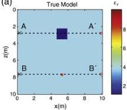
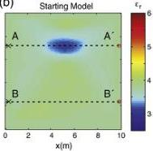
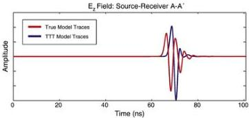
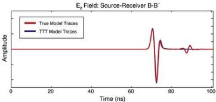

G. Meles et al. / Journal of Applied Geophysics 78 (2012) 31–43

37

(a)

(b)

(c)

(d)

Fig. 5. (a) True model yielding “observed data”. (b) Model obtained by traveltime tomography (TTT), (c) and (d) compare observed traces (red curve) and simulated traces (blue curve) using the TTT model along the source–receiver lines AA' and, BB', respectively. The traveltime difference is large in diagram (c) due to the size/permittivity contrast of the anomalous body, but it is negligible in diagram (d) because the body is very small. The critical time difference of more than half the dominant period of the pulse can cause trapping by a local minimum and failure of the FBID inversion. The PBED starts at low frequency, for which the time difference is a much smaller fraction of the dominant period, such that stability is more likely.

FBID. Under such circumstances, cycle skipping can occur, and PBED is required because it lengthens the effective period of the pulse. Fig. 5d shows the corresponding traces for source–receiver configuration BB'. For these traces, the traveltime difference is negligible; the only noticeable difference is the reflection from the low permittivity inclusion at later times. For this case, cycle skipping does not occur.

Obviously, with much lower frequency data (i.e., filtered versions), the time shift between the two traces in Fig. 5c would be a much smaller fraction of the dominant period of the signal and so any inversion would be less affected by it. However, having a time shift of less than half the dominant period of FBID is a necessary but not sufficient condition to guarantee success of the FBID inversion scheme. It can fail under other circumstances, as shown in a later example.

### 5.1.2. FBID inversions

Fig. 6b and h show the results of inversion when the FBID scheme is applied with homogeneous εᵣ and σ starting models. A minimum

source–receiver distance of 7 m was set for the waveform inversion in order to prevent artefacts from strong direct arrivals, which would otherwise dominate the gradients.

The large body (anomaly 1) is located correctly, but improperly characterised. Instead of a homogeneous block of low permittivity and low conductivity, a ring-shaped feature of low permittivity and a block of high conductivity are incorrectly mapped. The situation improves for the smaller body (anomaly 2), with good reconstruction both in terms of resolution and physical properties. As expected from simple analysis of the observed and simulated traces prior to the inversion, only the large anomaly is troubled by the non-linearity. The use of a traveltime tomography starting model does not improve the inversion significantly (see Fig. 6c and i).

### 5.1.3. PBED inversion

For all models analysed in this paper, the frequency content of the data used for the different iterations of PBED was assigned before the