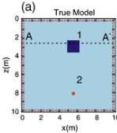
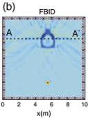
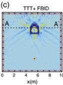
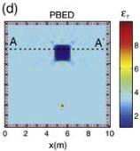
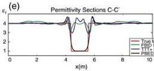
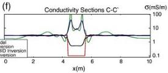
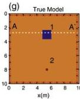
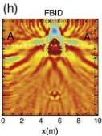
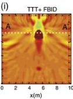
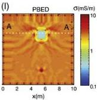

38

G. Meles et al. / Journal of Applied Geophysics 78 (2012) 31–43

Fig. 6. (a) True relative permittivity and (g) conductivity distributions of Model 1. Crosses and circles represent the sources and receivers employed in the 4-sided experiment. The resulting tomograms for the synthetic full-waveform inversion experiment are shown for three separate inversion approaches: (b) and (h) for FBID using homogeneous starting models, (c) and (i) for FBID using starting models based on traveltime tomography, and (d) and (l) for PBED using homogeneous starting models. Permittivity cross sections along line CC are shown in (e) and conductivity cross sections along the same line are shown in (f).

beginning of each inversion. The filtering was applied to the source signal rather than to the actual radargrams. Different filtered versions of the source signal in Fig. 2 were used for the first steps of the inversion. By applying a tapered bandpass filter with a fixed lower cut of 15 MHz and a variable higher cut, pulses of dominant frequency in the range of 50–200 MHz at 10 MHz spacing were selected and progressively implemented for 4 iterations before the whole bandwidth signal was used. We did not include frequencies less than 15 MHz because such spectral values are often small in real data cases and subject to noise capture. Coarser grid spacings could be profitably used at the first stages of the inversion when dealing with lower frequencies (hence longer wavelengths). This would reduce the computational effort in the forward modelling, but for our tests, the main emphasis was on scientific effectiveness and simplicity, not computational efficiency, so the same grid spacing was used at all steps of the inversion. The PBED algorithm should be made suitable for both field data applications as well as synthetic experiments. At the high cut frequency of 200 MHz (central frequency of the source signal), stability was anticipated and therefore the remaining iterations used the full frequency spectrum of the source. This scheme may of course be enhanced by implementing an optimised choice of the frequency, possibly by taking into account the trend of the error curve. For the purposes of this paper (i.e., to indicate the benefits of starting the inversion at low frequency and expanding the bandwidth as iterations proceed), we consider the adopted approach satisfactory.

Fig. 6d, e, f and l show the PBED inversion results. In this case, the low permittivity of anomaly 1 is well reconstructed, but its conductivity contrast with the background medium is underestimated. It is properly characterised as being significantly less conductive than the background, but because of its very limited sensitivity, the magnitude of the anomalous conductivity is not fully recovered. The characteristics of the smaller feature are equally well recovered (Fig. 6l), demonstrating that there are no drawbacks in the application of the new method to cases where the FBID scheme works well (also found for many other examples not reported in the present paper).

### 5.1.4. RMS Curves

Fig. 7 shows the RMS misfit curves for model 1 calculated according to the formula

$$RMS = \sqrt{\sum_{1}^{N} (D_i^{obs} - D_i^{cal})^2 / N}, \tag{2}$$

where D is the amplitude data at a particular time sample on a given trace, and subscripts "obs" and "cal" denote observed and calculated data (for the current model). The summation N is over all samples i for all traces (i.e., $N = N_S \times N_T \times N_R$, where $N_S$ is the number of samples per trace, $N_T$ is the number of transmitters and $N_R$ is the number of