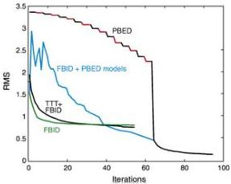
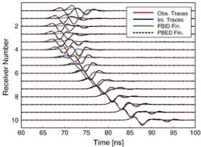

G. Meles et al. / Journal of Applied Geophysics 78 (2012) 31–43

39

receivers). The observed data remain the same for both FBID and PBED but the calculated data will involve much smaller amplitudes for PBED than for FBID because only a limited part of the spectrum is used in the former case. The dark blue and the green curves represent the RMS trends for the FBID inversions when traveltime tomography and homogenous starting models are used, respectively. Rather surprisingly, at the first FBID iteration, the RMS is larger for the traveltime tomogram starting model than for the homogenous starting model.

The black and red curve represents the RMS function for the new PBED scheme (using a homogeneous starting model); the different colours indicating that different expanded data are used each time the colour changes. For each successive bandwidth, four iterations are executed and then the frequency content is expanded. This continues up until iteration 64 as stability is approached (see Fig. 2 and Section 4). Note the precipitous drop in the RMS at this point, when the full bandwidth is employed. The difference in the size of the RMS values between the PBED and FBID results to the left of this point (with the PBED values being larger than those of FBID) is purely related to the way the RMS error is defined—only a fraction of the frequencies (albeit increasing) are used in the computed data for PBED, but for FBID all frequencies are employed. From Parseval's Theorem, this makes the computed data (trace amplitudes) for FBID larger and more comparable to the observed values. Therefore, in forming the squared difference between the first and second terms in Eq. (2), the net result is smaller in the case of FBID than for PBED. This is true only up to the point at which the PBED scheme uses the full bandwidth data. After this point, the convergence for the dark blue and green curves (FBID) is much worse than for the red and black curve (PBED), indicating that FBID is trapped in severe local minima. This issue is highlighted by the light blue curve, which shows the FBID convergence curve computed according to model updates made during the PBED inversions. The highly oscillatory nature of the light blue curve between iterations 1 and 16 shows the non-linear nature of the FBID inversion. The RMS values actually increase with increasing iterations over portions of this range. The only way to jump out of the local minima and to reach the global minimum is to start with a low frequency successively expanded data set, thus avoiding the "hills" in the FBID curve. Although not very noticeable at the scale plotted,

Fig. 7. RMS misfit curves for Model 1. The green and dark blue curves represent the convergence behaviour for the FBID inversion when the homogeneous and traveltime-tomography-based starting models are used, respectively. The black and red curve represents the convergence behaviour for the new PBED inversion scheme; the changing colours identify the bandwidth expansions (the inversion runs for 4 iterations for each bandwidth (as represented by each colour)). The light blue curve was computed for the FBID misfit, but updating the model was made according to the PBED results. This curve shows the oscillatory nature (increasing and decreasing RMS) and highly non-linear behaviour of the process up to around iteration 25. Clearly, FBID when used alone gets trapped in local minima. In contrast, PBED converges uniformly to the global minimum.

every one of the red and black segments of the PBED curve shows a slight downward trend, in contrast to the light blue FBID curve. Note, that at iteration number 20, the light blue curve reaches the same RMS value as for the starting model (green curve), and thereafter falls monotonically to the global minimum.

The new scheme needs twice as many iterations as the FBID scheme. The final RMS for the PBED results is ~25% of that for the FBID results.

Fig. 8 shows a selection of radargrams generated by a source placed at 3.3 m depth in the left borehole of model 1 and receivers located in the right borehole. For clarity, only traces for even numbered receiver positions are displayed. Four sets of colour-coded traces are presented. The red traces correspond to the synthetic observed data, the blue traces are the synthetic response for the traveltime tomogram, the green traces are those corresponding to the final model obtained by FBID inversion (based on the traveltime tomogram starting model) and the black traces are those for the final model obtained by PBED inversion. Note the excellent match between the black (PBED results) and red traces and the rather poor match between the green (FBID result) and red ones (the traces have been normalised and a linear time gain function applied).

### 5.2. Model 2—two cross-shaped anomalies of contrasting permittivity and conductivity

Next, we consider a more complex model involving two cross-shaped anomalies embedded in a homogeneous background (Fig. 9a and d). The background of model 2 is characterised by εr=4 and σ=3 mS/m. For anomaly 1, εr=1 and σ=0.1 mS/m, whereas for anomaly 2, εr=8 and σ=10 mS/m. The increased difficulty in imaging this very high contrast model does not simply consist of more complex structures (crosses instead of square blocks), but also in the mutual interactions caused by the embedded inclusions (scattering effects), present in at least some of the traces shown in Fig. 10. The data were generated using the same recording geometry as for model 1 and inverted using the FBID and the new PBED schemes.

The crosses within model 2 are large enough in terms of size and contrast to cause time-shifts between the traces comparable to half the period of the dominant frequency. For this reason, the FBID scheme is unable to locate and characterise either body (Fig. 9b and e). The result shown are for homogeneous starting models, but no improvement is obtained by using the traveltime tomograms as the starting models. In contrast, the PBED scheme based on homogeneous starting models is able to image both crosses (Fig. 9c and f). The permittivity image is

Fig. 8. For model 1, radargrams for a source at 3.3 m depth in the left borehole and all receivers in the right borehole of Fig. 6. Results are given for the observed traces (red), initial model using traveltime tomography (blue), final model obtained by FBID inversion (green) and final model obtained by PBED inversion (black). A time-variant gain has been applied, along with trace normalization. Note the excellent agreement between the red and black curves (they mostly overlap).