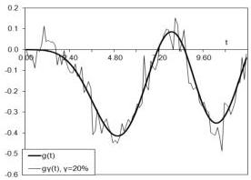
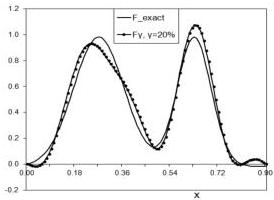

Inverse source problem for wave equation

11

We see in Table 3 that the discrepancy \(\eta\) is above the absolute noise level in \(g(t)\): \(\eta \approx \gamma_{1}\). This verifies the choice of the values of \(N\) and \(\alpha = 0\) made in the table for the each relative noise level \(\gamma\).

Table 3. Admissible values of the cut-off parameter \(N\), corresponding recovery errors \(\varepsilon_{F}\), discrepancy values \(\eta\) for different relative \((\gamma)\) and absolute \((\gamma_{1} = \| \delta g(t)\|_{L_{2}[0,T]})\) noise levels:

|  \( \omega = 8 \) | \( \gamma \) | 0% | 1% | 3% | 5% | 7% | 10% | 20%  |
| --- | --- | --- | --- | --- | --- | --- | --- | --- |
|   |  \( \gamma_1 \) | 0 | 0.0064 | 0.019 | 0.032 | 0.045 | 0.064 | 0.128  |
|   |  N | 20 | 17 | 14 | 11 | 11 | 11 | 9  |
|   |  \( \varepsilon_F \) | 0.46% | 0.7% | 1.5% | 2.3% | 3% | 4% | 7.6%  |
|   |  \( \eta \) | 0.003 | 0.008 | 0.021 | 0.033 | 0.044 | 0.061 | 0.122  |
|  \( \omega = 1 \) | \( \gamma \) | 0% | 1% | 3% | 5% | 7% | 10% | 20%  |
|   |  \( \gamma_1 \) | 0 | 0.0076 | 0.023 | 0.038 | 0.053 | 0.076 | 0.152  |
|   |  N | 20 | 13 | 11 | 10 | 10 | 9 | 9  |
|   |  \( \varepsilon_F \) | 0.6% | 2.3% | 3.7% | 4% | 5% | 6.5% | 12%  |
|   |  \( \eta \) | 0.0005 | 0.008 | 0.025 | 0.036 | 0.05 | 0.072 | 0.143  |

Results of recovery based on parameters and other inputs taken from Table 3 are presented in Fig.1 for the case of \( H(t) = \Phi''(t) \), \( \Phi(t) = \sin (t + 1.373)\exp (-0.2t) \).

Рис. 1: The identified spacewise source \( F(x) \) (right figure) from \( 20\% \) noisy data (left figure) with parameter \( N = 9 \) defined in Table 3 for \( \omega = 1 \).

Since the matrix \(\mathbf{A}\) does not depend on \(F(x)\), the parameters \(N\), \(\alpha\) can be defined once for given \(H(t)\) and then used again for wide range of functions \(F(x)\). Further we take parameters listed in Table 3 to recover other functions, including the combination of three Gaussians \(F(x) = -0.1\exp (-((x - 0.3l) / 0.05l)^2) + 0.1\exp (-((x - 0.5l) / 0.05l)^2) + \exp (-((x - 0.7l) / 0.05l)^2)\) and the function generated from the standard linear finite element \(F(x) = \eta (4(x - 0.5l) / l)\). The results are depicted in Fig. 2-3 for the case of \(5\%\) noisy data. Then the algorithm has been applied for recovery of discontinuous functions \(F(x)\). In that case only approximate agreement has been achieved. The result is represented in Fig.4. It follows from numerical simulations that better results are obtained for higher frequency \(\omega\) and higher decay coefficient \(\nu\) of the function \(\Phi (t) =\)