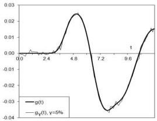
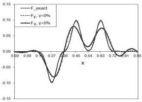
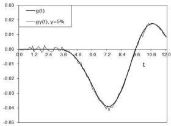
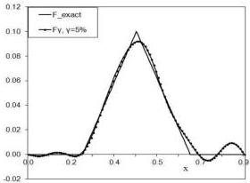

12

Balgaisha Mukanova, Vladimir G. Romanov

Рис. 2: The identified spacewise source $F(x)$ (right figure) from noise free and 5% noisy data (left figure) with $N = 20$ and 10 for $\Phi(t) = \sin(t + 1.373) \exp(-0.2t)$.

Рис. 3: The identified spacewise source $F(x) = \eta(4(x - 0.5l)/l)$ (right figure) from 5% noisy data (left figure) with $N = 10$ for $\Phi(t) = \sin(t + 1.373) \exp(-0.2t)$.

$\sin(\omega t + \beta) \exp(-\nu t)$. Numerical simulations show that in the case of smooth $F(x)$ for given parameters $c, T$ and the function $H(t)$, the admissible values of $N$ can be found via numerical experiments on synthetic data.

## Conclusion

In this paper, we studied an inverse problem of identifying the unknown spacewise dependent source $F(x)$ in the one-dimensional wave equation $u_{tt} = c^2 u_{xx} + F(x)H(t - x/c)$, $(x, t) \in \Omega_T$, which is treated as an approximate model of GPR data interpretation process. The case of boundary measured data $g(t) := u(0, t)$ is considered. Perturbation of the media via the radar signal is formulated in terms of the function $H(t - x/c)$ and the non-homogeneity of electrical permittivity is expressed via the function $F(x)$ with