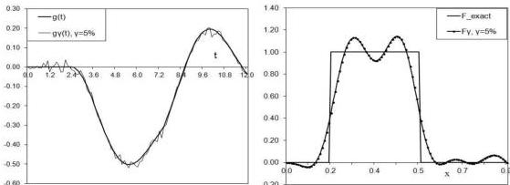

Inverse source problem for wave equation

13

Рис. 4: Recovery of discontinuous source $F(x)$ (right figure) from 5% noisy data (left figure) with parameters listed in Table 2 for $\omega = 1$.

finite support in $(0, l)$, $l = cT/2$. We develop a simple algorithm for reconstruction of a spacewise dependent source term $F(x)$, based on integral formula for the solution of the direct problem with subsequent minimization of the regularized Tikhonov functional. The proposed algorithm allows one to reconstruct the unknown source from random noisy data up to 10% noise level for a reasonable choice of the function $H(t)$. Note that this method can also be applied to obtain an initial iteration for Conjugate Gradient Algorithm solving the coefficient inverse problem for a hyperbolic equation $u_{tt} = c^2(x)u_{xx}$ with variable wave propagation speed.

## Acknowledgement

The work of the first author was supported by the Ministry of Education and Science of Republic of Kazakhstan, under the Grant No. 316 (13 May, 2016).