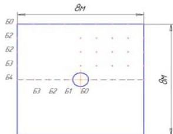

ISSN 2007-9737

6 Kazizat Iskakov, Dinara Tokseit, Samat Boranbaev, et al.

Fig. 1. Measurement scheme

This method consists in comparing the obtained radarograms with the standard views available in the database. There is a different direction of radarogram interpretation, namely computer modelling of propagation and reflection of electromagnetic waves in a medium.

The radarogram provides information about the travel time to the heterogeneity, and the task of interpreting radarograms is to determine the physical characteristics of the heterogeneity.

In GPR studies, the measurement data obtained by the GPR antenna is a response of the medium and is a function of travel time. This data is then used as additional information to solve inverse coefficient problems.

To numerically solve this kind of inverse problem, we apply an optimization method, the essence of which is minimization of the quadratic functional of inconsistency of calculated and observed fields (data from the receiving antenna of GPR).

In computer simulations, to solve the inverse coefficient problem, a tabular value of the perturbation source as well as tabular values of the reflected signals at the measurement points are needed.

In order to solve these issues, we have developed a source reconstruction algorithm in this paper. The physical characteristics of the investigated objects include: dielectric and magnetic permeability and conductivity of media.

The issues of numerical method for solving inverse coefficient problems for the geoelectric equation are discussed in the monograph by S. I. Kabanikhin [10].

Application of optimization methods for numerical solution of a class of coefficient inverse problems is presented in the monograph by K.T. Iskakov et al. [8].

The use of engineering methods for interpreting radarograms, the essence of which consists in determining the geoelectric section: dielectric and magnetic permeability; conductivity and depth of heterogeneity are considered in a series of works [24, 20, 23, 12].

The method of layer-by-layer recalculation, for inverse problems in the case of layered media, is widely used.

The idea of layer-by-layer recalculation is that the differential equation describing this process is reduced to Riccati differential equation by special function substitution, for which the solution can be written out in analytical form [15].

The theoretical foundations and practical applications of subsurface georadolocation are outlined in [2, 16, 6, 3, 9, 4].

The theory of uncorrected and inverse problems received a rapid development in the 20th century and goes back to the first works in this direction by academician A.N. Tikhonov [18].

The theoretical aspects and numerical methods for solving inverse coefficient problems for the geoelectric equation are devoted to a monograph by V.G. Romanov and S.I. Kabanikhin [17].

The application of optimization methods for the numerical solution of the coefficient inverse and its theoretical justifications are given in the monograph by S.I. Kabanikhin and K.T. Iskakov. [11].

One of the first algorithms of layer-by-layer recalculation for solving a second-order differential equation for a horizontally layered homogeneous medium is described in the work by A.N. Tikhonov and D.N. Shakhsuvarov. [19].

For solving the practical task of electrical prospecting, this algorithm was used in the work by Dmitriev V.I. [5]. In works of Karchevsky A.L. [13, 14] described an algorithm of solution of seismic task for a horizontally layered medium,

Computación y Sistemas, Vol. 27, No. 1, 2023, pp. 5–12
doi: 10.13053/CyS-27-1-4543