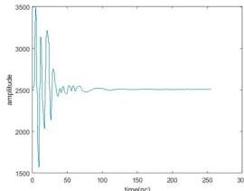
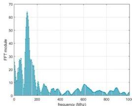

ISSN 2007-9737

Computer Modeling of the Outgoing GPR Signal 9

Let us define the following variables in order to make the following expressions easier to understand:

$$A = \hat{q}^r - \frac{\alpha}{\alpha^2 - (\omega - \omega_0)^2}, \quad (27)$$

$$B = \frac{(-1)(\alpha^2 + (\omega - \omega_0)^2) - 2\alpha^2}{(\alpha^2 - (\omega - \omega_0)^2)^2}, \quad (28)$$

$$C = \frac{-(\omega - \omega_0)2\alpha}{[\alpha^2 + (\omega - \omega_0)^2]^2}, \quad (29)$$

$$D = \frac{\alpha[2(\omega - \omega_0)]}{(\alpha^2 + (\omega - \omega_0)^2)^2}, \quad (30)$$

$$K = \hat{q}^i + \frac{\omega - \omega_0}{\alpha^2 + (\omega - \omega_0)^2}, \quad (31)$$

$$N = \frac{(-1)[\alpha^2 + (\omega - \omega_0)^2] + (\omega - \omega_0)^2}{[\alpha^2 + (\omega - \omega_0)^2]^2}. \quad (32)$$

With these definitions in place, we can proceed with the following:

$$\frac{\partial \psi}{\partial \alpha} = \sum_{\omega} \left\{ 2AB + 2 \left[ + \frac{\omega - \omega_0}{\alpha^2 + (\omega - \omega_0)^2} \right] C \right\}, \quad (33)$$

$$\frac{\partial \psi}{\partial \omega_0} = \sum_{\omega} \{ 2[A]D + 2[K]N \}. \quad (34)$$

Apply the method of conjugate gradients [17]:

$$\left[ \begin{array}{c} \alpha \\ \omega_0 \end{array} \right]^{k+1} = \left[ \begin{array}{c} \alpha \\ \omega_0 \end{array} \right]^k - \gamma_k P_k. \quad (35)$$

Here $P_k = \nabla \psi [\alpha^k, \omega_0^k] - \beta_k P_{k-1}$:

$$\nabla \psi = \left[ \begin{array}{c} \frac{\partial \psi}{\partial \alpha} \\ \frac{\partial \psi}{\partial \omega_0} \end{array} \right], \quad (36)$$

$$\beta_k = - \frac{\left| \left| \nabla \psi [\alpha^k, \omega_0^k] \right| \right|^2}{\left| \left| \nabla \psi [\alpha^{k-1}, \omega_0^{k-1}] \right| \right|^2}. \quad (37)$$

10. The next approximations $\alpha^{k+1}, \omega_0^{k+1}$ will be calculated using conjugate gradient formulas (35)-(37).

Fig. 2. Radarogram trace plot. (The antenna is positioned from the source at a distance of - 1 metre)

Fig. 3. Spectrum of the radarogram trace. (The antenna is located at a distance of 1 metre)

11. As a result of the calibration, the final original source is as follows:

$$F(t) = e^{-\alpha^* t} \cos(\omega_0^* t), \quad (38)$$

where: $\alpha^*, \omega_0^*$ are the found values for which the functional (25), reached a minimum.

The found value of the source, can be used to solve the forward problem, and the inverse problem of determining the dielectric permittivity and conductivity of the media.

Computación y Sistemas, Vol. 27, No. 1, 2023, pp. 5-12
doi: 10.13053/CyS-27-1-4543