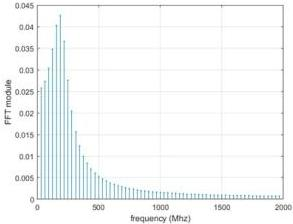

ISSN 2007-9737

10 Kazizat Iskakov, Dinara Tokseit, Samat Boranbaev, et al.

Fig. 4. Source spectrum graph. (The antenna is located at a distance of - 1 metre)

### 3 Experimental Results

Experimental studies on reception of reflected signals from a homogeneous site (river sand) were carried out. The experiment was carried out with a Loza-V series GPR, with antenna sweep: 100 cm.

Research task: geophysical investigation of homogeneous clean sand underlayer structure: simulation of pulse source from "Loza-V" series device; determination of spectral characteristics of signals emitted by the antenna.

Calculation of the source signal in tabular form, are necessary in the future for solving inverse coefficient problems in determining the geoelectric section. A homogeneous section, river sand, measuring 8 metres in width and in length, was chosen for the experiments.

An experiment was carried out in which the GPR source was placed at point B0 and the antenna was placed at a distance of 1 metre and is shown in Fig. 1. Trace plots, i.e. the response of the medium is shown in Fig. 2.

The actual radarogram data, which has its own format, has been converted into a text format of tabulated signal values. Signals received from Loza-V series GPR are output in "geo" format. For signal analysis and visualization we convert from the binary format of the file "geo" in the format "txt".

File "txt" consists of three columns: x, t, alg. Where: x - number of data received from each observation point, by default x=0 ... 10; T - time, T0=0 ns, T512=255,5 ns, step 0.5 ns; Alg - amplitude values.

To encode the amplitude value of an analogue signal, an 8 or 16 bit representation of the amplitude values is used.

In the case of 8-bit encoding, the amplitude measurements of the analogue signal will be obtained with an accuracy of 1/256 of the dynamic range of the digital device, since 8 bits allow 28 numbers to be represented-256).

The digital signal in this encoding is then a set of numbers from 0 to 255 (or -128 to 127). This accuracy is not sufficient to reconstruct the original signal because there will be errors of non-linear distortion.

If you encode the amplitude of the analogue signal to 16 bits, you will have 265 times the accuracy. Digit capacity of 16 bits allows to encode 216=65536 values of amplitude.

A digital signal is then a collection of numbers from 0 to 65535 (or -32768 to 32767). This coding approach keeps nonlinear distortion to a minimum. A digital signal is a dimensionless set of numbers and has no common units of measurement.

The radarogram data, which has its own format, is converted into a text format of tabulated signal values. Fig. 2 shows a graphical representation of the response.

### 4 Related Work

The spectrum of the radarogram trace (medium response), is shown in Fig. 3. The frequency scale of the graph varies from 0 to 1000MHz.

The modulus of the frequency distribution of the signal $u(r_0, 0, \omega)$ can be seen in Fig. 3. Having the radarogram trace spectra, using equation (2.) we have:

$$\int_{0}^{\infty} \frac{u(r_0, 0, \omega_i) = \hat{q}(\omega_i)}{\sqrt{\xi^2 - (\omega_i \mu_0 \varepsilon_1 - i \omega_i \mu_0 \sigma_1)} + \sqrt{\xi^2 - \omega_i^2 \mu_0 \varepsilon_0}} d\xi. \tag{39}$$

Computación y Sistemas, Vol. 27, No. 1, 2023, pp. 5–12
doi: 10.13053/CyS-27-1-4543