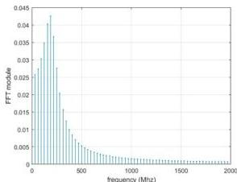

ISSN 2007-9737

Computer Modeling of the Outgoing GPR Signal 11

For $i = 1, 2, 3, \dots, n/2$. Let us represent the integral of the complex function in equation (39) as:

$$\int_0^\infty \frac{\xi J_0(\xi r_0)}{\sqrt{\xi^2 - (\omega^2 \mu_0 \varepsilon_1 - i \omega \mu_0 \sigma_1)} + \sqrt{\xi^2 - \omega^2 \mu_0 \varepsilon_0}} d\xi$$
$$= \int_0^\infty (p(\xi) + iq(\xi)) d\xi = \int_0^\infty f(\xi) d\xi. \quad (40)$$

The numerical calculation of the integral (40) is realised by the iterative rectangular (or trapezoidal) method:

$$\int_0^\infty f(\xi) b\xi \approx h \sum_{j=0}^\infty f(\xi_j). \quad (41)$$

The summation is carried out to a given accuracy $\varepsilon$:

$$|f(\xi_j)| < \varepsilon.$$

The following parameters were used in the calculation: $\varepsilon_0 = 1$, $\varepsilon_1 = 5$, $\mu_0 = 1$, $r_0 = 1$, $\sigma_1 = 1/500$. The graph of the source spectrum is shown in Fig 4.

By inverse Fourier transform of the spectrum $q(\omega)$ we find the absolute (complex) source signal. The plot of the real part of the source signal, in the case of our experiment is shown in Fig. 5.

Fig. 5 below shows a graph of the reconstructed source, when the antenna is located at a distance of 1 metre from the source.

A certificate of authorship No 31827 dated "17" January 2023 [21] was received for GPR signal source detection program.

## 5 Conclusion

We considered a computer model to reconstruct the shape and tabular value of the source on the basis of real data of signals from the Loza-V series GPR receiver.

As a result of strictly justified mathematical calculations, we obtained an explicit expression linking the spectrum function describing the response of the medium (real radar data) and the spectrum function describing the source behavior.

Based on the found source spectrum on the basis of inverse Fourier transform, the emitted

Fig. 5. Graph of the recovered signal source, from experiment

GPR source itself is reconstructed in tabular form and its graphical representation.

The results of researches of this article can be applied to numerical solution of inverse coefficient problems, as it is necessary to have a tabular value of the source of disturbance, as well as tabular values of reflected signals (GPR data), in the points of measurements.

A series of numerical calculations were carried out to show the effectiveness of the considered computer model on source recovery.

## References

1. Aleksandrov, P. N. (2017). Theoretical foundations of the GPR method. Editorial de Literatura de Física y Matemáticas de Moscú.
2. Andriyanov, A. V. (2005). Issues of subsurface radiolocation. Collective monograph, Moscow: Radiotekhnika, pp. 416.
3. Conyers, L. B., Goodman, D. (1997). Ground-penetrating radar: An introduction for archaeologists. AltaMira press.
4. Daniels, D. J. (2004). Ground penetrating radar. The Institution of Electrical Engineers, London, UK. DOI: 10.1049/PBRA015E.

Computación y Sistemas, Vol. 27, No. 1, 2023, pp. 5–12
doi: 10.13053/CyS-27-1-4543