Monte Carlo full-waveform inversion

H27

into one single theory. The method of sequential Gibbs sampling used with the extended Metropolis algorithm has provided a further step toward bridging probabilistic inverse problem theory and the field of geostatistics, even for highly nonlinear and non-Gaussian inverse problems (Hansen et al., 2008; 2012). Hansen et al., (2009; 2012) discussed how the complexity of inverse problems (i.e., the time needed to obtain an a posteriori sample) is reduced when a statistical a priori model with some degree of spatial correlation between the model parameters is considered. They showed that the effective dimension of the solution space of the inverse problem, using two-point-based a priori models, is considerably decreased when the a priori expected range of spatial correlation is increased. On the other hand, when no spatial correlation was considered, the high-dimensional inverse problem became unsolvable. Further, it was seen that whether the model parameters take values from a set of real or binary numbers had insignificant influence on the effective dimension compared with the degree of correlation between the model parameters. Hence, we consider the reduction of the effective dimension due to a priori defined spatial autocorrelation to be one of the keystones that makes Monte Carlo inversion of a computationally hard, full-waveform inverse problem feasible, even with thousands of (here 6240) model parameters.

In this study we wish to demonstrate that we are able to freely choose multiple-point-based a priori information, defined by, e.g., the Snesim algorithm, for Monte Carlo-based inversion. We considered a model with categorical parameters only, but this choice of using a multiple-point-based a priori model was a first step away from using simplified a priori models like the Gaussian model. We believe that such models are often chosen out of mathematical convenience rather than for the sake of geophysically and geologically based a priori expectations.

On the basis of the studies of Hansen et al. (2009), we believe that the solution space of the full-waveform inverse problem (i.e., the complexity of the inverse problem), considered in this study, is primarily reduced due to the multiple-point-based spatial correlations, and not significantly due to the binary model parameters. Accordingly, full-waveform inversion may also be tractable when making

use of two-point-based statistical a priori models with both continuous and categorical model parameter values, as long as some degree of spatial correlation can be considered a priori. This is also confirmed by our preliminary studies on this topic. The above discussion is encouraging with regard to the possibility of using a priori models based on either two-point statistics, multiple-point statistics, or a combination of both, as long as the chosen a priori model imposes some degree of spatial autocorrelation of the model parameters (see Journel and Zhang [2007] and further discussions at the end of this section). This provides a flexible tool for defining an appropriate a priori model that actually captures our a priori expectations.

The suggested inversion strategy is very general and may be equally applicable for tomographic inversion of any kind of data (e.g., GPR, seismic, x-ray, or electroencephalography data) or for reflection seismic inversion. In the example presented here the algorithm only inverts for the dielectric permittivity, whereas the electrical conductivity is kept fixed. The method could, however, be extended to invert for both parameters by introducing a step, just before the exploration step, that randomly chooses in which of the two fields the exploration should be performed.

A pseudo-full-waveform inversion approach for tomographic GPR data was proposed by Gloaguen et al. (2007). In their approach, multiple model realizations were obtained using a stochastic ray-based inversion strategy. Full-waveform simulations were subsequently calculated in these multiple models. Models related to waveform data that showed the best fit to the observed data were regarded as estimates of the waveform inversion. However, their approach does not guarantee a data fit within the uncertainties and the accepted models are not realizations from an a posteriori probability density function.

In this study the sequential Gibbs sampler is applied such that a continuous block of model parameters are resimulated in each step. Irving and Singha (2010) also used a type of sequential Gibbs sampling, but resimulated a subset of model parameters scattered randomly across the model. Note that sequential Gibbs sampling will correctly sample the a priori probability density function regardless

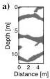

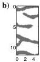

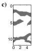

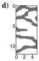

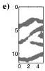

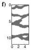

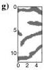

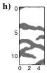

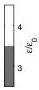

Figure 8. Eight statistically independent realizations of the a priori probability density (a priori movie).

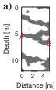

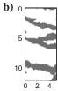

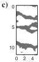

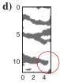

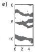

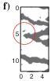

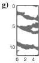

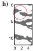

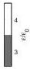

Figure 9. Eight statistically independent realizations of the a posteriori probability density (a posteriori movie).

Downloaded 02 Mar 2012 to 130.225.69.247. Redistribution subject to SEG license or copyright; see Terms of Use at http://segdl.org/