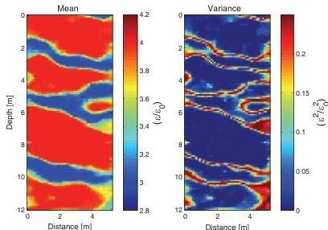
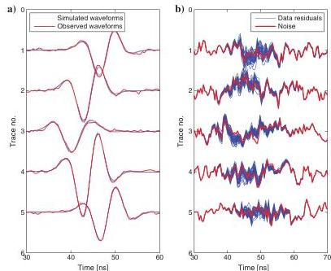

H28

Cordua et al.

of how that subset of model parameters to be resimulated is chosen (Hansen et al., 2012). Whether the continuous or the scattered exploration strategy should be used is still to be investigated, as such a choice may affect the computational efficiency when the sequential Gibbs sampler is used with the Metropolis algorithm. To understand

exploration strategies of high-dimensional spaces, more analytical approaches are required.

Ray-based inversion experiments on the same scale as the setup used in this study typically involve in the order of 700 to 1600 transmitter-receiver pairs to obtain a reasonable resolution (e.g.,

Figure 10. The mean and variance of the model parameters calculated on the basis of the a posteriori sample.

Figure 11. (a) A posteriori data variability. Blue curves: Simulated waveforms calculated for 45 statistically independent a posteriori models. Red curves: The observed waveform data. (b) Data residuals. Blue curves: The data residuals for 45 statistically independent a posteriori models. Red curves: The uncertainty component of the observed data. The waveforms are associated with the transmitter-receiver pairs indicated by the numbers 1–5 in Figure 3.

Tronicke and Holliger, 2005; Looms et al., 2008; Nielsen et al., 2010). In this study a high degree of resolution was obtained with as few as 20 transmitter-receiver pairs. However, in field experiments modeling inadequacies may lead to considerably more uncertainty in the data than considered in this study, which in turn leads to a lower resolution. In crosshole GPR full-waveform inversion the long spatial wavelengths of the model are typically used as a starting model. This model is obtained through ray-based inversion of first-arrival traveltimes and amplitudes of the waveform data (Ernst et al., 2007a; Meles et al., 2010). The data set considered in our study is expected to be too sparse to provide any useful information for a ray-based starting model. We, therefore, choose to start the full-waveform inversion in an unconditional realization of the a priori probability density, and burn-in is obtained anyway. Hence, the role of the a priori model is more than simply finding a posteriori model realizations that jointly honor data and the a priori model. It turns out that the use of a consistent a priori model acts as a guide in the burn-in process that allows the initial model to be far away from the true solution. The successful convergence from the data-independent starting model observed in the present study may be explained as a reduction of the complexity of the problem through the informative a priori information defined through the geostatistical algorithm (see Hansen et al., 2009; 2012). This encouraging observation suggests that future effort should be toward incorporating complex statistical a priori information into (adjoint) optimization based inversion approaches.

The most commonly used method for full-waveform inversion today is based on adjoint methods, as suggested by Tarantola (1984). This approach has some limitations: (1) Uncertainty estimates may theoretically be obtained through an a posteriori covariance, but only for a linear approximation of the forward relation limited to a Gaussian description of the data uncertainty and a priori model (Tarantola, 1984). (2) The method is based on simple Gaussian a priori information (if any at all); and (3) it relies on a subjective convergence criterion that may adversely result in data uncertainties propagating into the model estimate. The method we propose overcomes many of the limitations of using the adjoint-based approach. (1) It allows for arbitrary data geometry and density. (2) Complex a priori inversion can be included using any geostatistical

Downloaded 02 Mar 2012 to 130.225.69.247. Redistribution subject to SEG license or copyright; see Terms of Use at http://segdl.org/