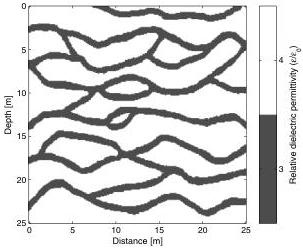

Monte Carlo full-waveform inversion

H23

equal to the probability that it leaves this neighborhood, the algorithm is said to satisfy microscopic reversibility. It can be shown that if a sampling algorithm satisfies microscopic reversibility, then the a posteriori probability density is the only equilibrium distribution for the algorithm, and the algorithm will converge toward this equilibrium distribution independently of the starting model. This property is satisfied by the extended Metropolis algorithm (see Mosegaard and Sambridge [2002] for a detailed description of the Metropolis algorithm). In practice, the extended Metropolis algorithm has reached the equilibrium distribution when the likelihood values start to fluctuate around a constant level (referred to as the equilibrium level) and the data are fitted within their uncertainties. When this phase is reached the algorithm is said to be burned-in. In case of a nonlinear full-waveform inverse problem the structure of the a posteriori probability density is completely unknown. If this distribution is multimodal, several modes may exist that fit data with the uncertainty. Hence, no guarantee can be given, no matter the choice of sample strategy, that the a posteriori probability density is appropriately represented (i.e., that all modes are represented) by a finite sample size.

The a posteriori probability density is defined over a high-dimensional space and leaves only small areas of significant probability. Therefore, the burn-in period may be long because the algorithm during this period randomly walks across large parts of this high-dimensional space searching for a small area of significant probability. As a consequence, we suggest performing large exploration steps in the initial part of the burn-in period and then gradually decreasing the exploration step size as the algorithm approaches the equilibrium level. In this way, the large-scale structures of the model are relatively quickly established in the initial part of the burn-in period, after which the algorithm gradually establishes the smaller-scale structures. However, microscopic reversibility cannot be guaranteed when the exploration step size is not kept constant while running the algorithm. Therefore, the algorithm is stopped when "apparent" burn-in has been reached and the exploration step size is subsequently set to a constant value.

The algorithm is started in an unconditional realization of the a priori model, which is expected to be far away from volumes of significant a posteriori probability density. We suggest adaptively adjusting the exploration step size during the burn-in period such that the Metropolis acceptance probability (equation 3) controls the exploration step size. This is controlled by updating the exploration step size after every M successive exploration steps of the Metropolis algorithm. The exploration step size update is performed just after the exploitation step (step 1) of the algorithm. Consider that the algorithm is at iteration number K, where K is a multiple of M. Then the exploration step size $E_{\text{step}}^{i+1}$ during iteration number $K+1$ to $K+M+1$ (i.e., the next M iterations) is given as

$$E_{\text{step}}^{i+1} = E_{\text{step}}^i \frac{P_{\text{average}}}{P_{\text{control}}}, \tag{6}$$

where $E_{\text{step}}^i$ is the exploration step size during iteration number K-M to K (i.e., the M preceding iterations). $P_{\text{average}}$ is the average Metropolis acceptance probability (equation 3) during iteration number K-M to K and $P_{\text{control}}$ is a subjectively chosen constant acceptance ratio that the algorithm tries to adhere to by adjusting the exploration step size according to equation 6. For larger values of $P_{\text{control}}$, the exploration step size decreases faster and converges to a lower level, than it does for smaller values. The minimum possible

exploration step size involves resimulation of one model parameter, whereas the maximum step size is an (unconditional) simulation of all the model parameters that are statistically independent of the previous model.

## A SYNTHETIC CROSSHOLE GPR FULL-WAVEFORM INVERSE PROBLEM

The methodology outlined above is tested on a synthetic tomographic crosshole GPR full-waveform data set. Wavefield simulations of the GPR signals (i.e., the forward relation) are obtained using FDTD calculations of Maxwell's equations in transverse electric mode (Ernst et al., 2007b). This FDTD method provides grid-based time-domain calculations of the electromagnetic wavefield propagation. The transmitting and receiving antennae are simulated as vertically orientated dipole-type antennae and are aligned parallel with the vertical boreholes. Transmitted and received signals concern the vertical component of the electrical field (Holliger and Bergmann, 2002). The FDTD algorithm by Ernst et al. (2007b) yields second-order accuracy in both time and space, and performs the calculations in 2D Cartesian coordinates. The edges of the FDTD grid are surrounded by a generalized perfectly matched layer (GPML) to absorb artificial boundary reflections.

The a priori information of the inverse problem is provided by the Snesim algorithm. Snesim is a fast geostatistical simulation algorithm that produces realizations (conditional or unconditional to point data) from a high-dimensional probability density that contains the spatial relations (i.e., patterns) learned from a training image for a relatively low number of categorical values (Strebelle, 2002). Figure 1 shows a training image that mimics a matrix of unconsolidated sand with embedded channels of gravel situated in an unsaturated environment. The geological information contained in the training image may have been obtained from outcrops in a nearby gravel pit and/or a natural cliff. The training image applied here does not necessarily represent a realistic near-surface environment, but is rather used to demonstrate the principle that geologically realistic features, such as complex channel structures, can be

Figure 1. Training image containing geological information of the environment at which the crosshole GPR experiment is conducted. This information is used as a priori information in the waveform inversion.

Downloaded 02 Mar 2012 to 130.225.69.247. Redistribution subject to SEG license or copyright; see Terms of Use at http://segdl.org/