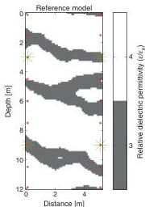
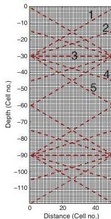

H24

Cordua et al.

represented by a multiple-point-based a priori model in the inversion procedure. Electromagnetic signals in the near-surface sediments are sensitive to the dielectric permittivity, the electrical conductivity, and the magnetic permeability of the materials. In this study we limit ourselves to considering only the influence of the dielectric permittivity, which is primarily governing the phase velocity of the signal. The relative dielectric permittivity of the sand and the gravel channel is set to $\varepsilon_r = 4.0$ (0.150 m/ns) and $\varepsilon_r = 3.0$ (0.173 m/ns), respectively (e.g., Ernst et al., 2006). The relative dielectric permittivity is given as $\varepsilon_r = \varepsilon/\varepsilon_0$, where $\varepsilon$ is the absolute dielectric permittivity and $\varepsilon_0$ is the dielectric permittivity of free space.

Figure 2 shows the synthetic reference model to be considered and is, at the same time, an unconditional realization of the training image obtained using Snesim. The electrical conductivity is set to a constant value of 3 mS/m and in the following it is assumed known. Near-surface materials are considered nonmagnetic and the magnetic permeability is set to the magnetic permeability of free space (e.g., Davis and Annan, 1989).

A full-waveform synthetic data set is calculated using the FDTD algorithm. A Ricker wavelet with a central frequency of 100 MHz is used as the source pulse. The source pulse is assumed known during the inversion. The recorded synthetic GPR full-waveform data are the vertical component of the electrical field. The experiment is conditioned by data from four transmitters (two in each borehole) at depths of 3 m and 9 m. The receivers are equidistantly distributed in the two boreholes with a separation distance of 1.5 m (see Figure 2). Data acquired with a transmitter-receiver angle larger than 45° from horizontal are omitted since, in practice, these data are violated by effects of wave guiding in the boreholes (e.g., Peterson, 2001) and travel paths between the antenna tips instead of the center of the antennae (Irving and Knight, 2005). These effects are, among several other sources of uncertainty, a result of inadequate forward modeling which has to be seriously considered in field experiments. Such effects either have to be handled through a refined forward modeling approach, or accounted for in the likelihood function through a statistical description of the data uncertainties imposed by both data noise and modeling inadequacies. See

Figure 2. Synthetic reference model. Green asterisks show transmitter positions and the red dots show receiver positions.

the discussion for a further treatment of these issues. The data geometry leads to a total of 20 recorded waveform traces. The resulting transmitter-receiver positions are connected with dotted lines in Figure 3 on top of the grid of the 6240 unknown model parameters.

Gaussian-distributed data uncertainties with a temporal autocorrelation described by the exponential correlation function in equation 5 are added to the waveform data. The temporal correlation length $a$ (i.e., the range) is set to 12.7 ns. Figure 4 shows the five waveform traces related to the uppermost transmitter position in the left borehole (see Figure 2), which are related to the transmitter-receiver pairs marked by the numbers 1 to 5 in Figure 3. The noise-free simulated waveforms are plotted as dotted blue curves and the uncertain waveforms (noisy waveforms) are plotted as red curves. The 20 uncertain waveform traces are used as observed data in this study and have an average signal-to-noise ratio of 13.6. The uncertainty imposed on the “noise-free” data mimic the total contribution of data noise and modeling inadequacies. In the next section, full-waveform inversion will be performed on the uncertain waveform data with a priori information based on a geostatistical model inferred from the training image in Figure 1.

## RESULTS

### Burn-in

In the present example the algorithm is started in a realization of the multiple-point a priori model learned from the training image, unconditional to any information from the data. In this way the starting model is independent of data and relies only on the a priori information. The initial exploration step size has a side length of $E_{\text{step}} = 12$ m, which corresponds to the maximum dimension of the model size. Hence, the exploration step size cannot exceed this side length and at this point the algorithm produces statistically

Figure 3. The transmitter-receiver positions connected by dotted lines on top of the 2D grid of $(120 \times 52 = 6240)$ unknown model parameters. The lines marked by the numbers 1 to 5 are related to the waveform data shown in Figure 4.

Downloaded 02 Mar 2012 to 130.225.69.247. Redistribution subject to SEG license or copyright; see Terms of Use at http://segdl.org/