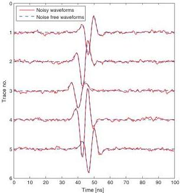
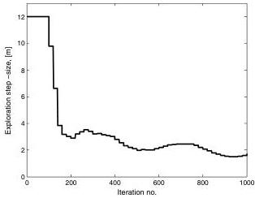

Monte Carlo full-waveform inversion

H25

independent realizations. The control acceptance, $P_{\text{control}}$, is set to 10% to obtain a relatively large exploration step size during the burn-in period. The exploration step size is evaluated after each 20th iteration (i.e., $M = 20$) according to equation 6. The evolution of the adaptive exploration step size during the first 1000 iterations is seen in Figure 5. It is observed that the exploration step size is constant and high in the very first part, after which it gradually decreases and stabilizes at a constant level of approximately $E_{\text{step}} = 2$ m. The associated development of the model is demonstrated in Figure 6. It is seen that the large-scale structures are very quickly brought into place, whereupon only fine-scale features of the model are accepted by the Metropolis rule (equation 3). After approximately 17,000 iterations the likelihood values start to fluctuate around an equilibrium level and the data residuals resemble a normal distribution with approximately the same standard deviation as the distribution of the noise. At this stage it is assumed that the algorithm has reached burn-in and produces representative realizations of the a posteriori probability density.

## A posteriori statistics

The last model accepted by the Metropolis rule in the burn-in period is used as the starting model when the Metropolis algorithm is subsequently restarted with a constant exploration step size of 1 m. The results obtained in this study demonstrate that the equilibrium level does not change after the Metropolis algorithm is restarted with a constant exploration step size. In addition the data residuals of this period resemble a normal distribution with a standard deviation of $2.17 \cdot 10^{-4}$. As a comparison the standard deviation of the normal distributed noise is $2.24 \cdot 10^{-4}$, which demonstrates that the data are fitted within the data uncertainties.

Figure 4. Five waveform traces with and without added noise. The signal-to-noise ratios of the plotted waveform traces are (from the top) 15.4, 20.8, 8.8, 41.3, and 22.2, respectively. The waveforms are related to the transmitter-receiver pairs marked by the numbers 1–5 in Figure 3.

Hence, this shows that the algorithm has reached burn-in and that the adaptive exploration step size may be appropriate when the step size converges toward a constant level (which is the case in our study). This burn-in strategy may serve as an approximate way of determining which exploration step size should be used to obtain a certain average acceptance probability. See Gelman et al. (1996) for an investigation on the choice of acceptance probability.

After 300,000 iterations the algorithm was stopped. During the sample period the algorithm had an average acceptance probability of 40%. Figure 7 shows the autocorrelation between the first model after burn-in and its correlation to the next 150,000 models obtained from the a posteriori probability density. These models are not statistically independent because any proposed model in the Metropolis algorithm is a perturbation of a current model or when a proposed model is rejected the current model counts again. Therefore, the autocorrelation analysis of the a posteriori sample shows some correlation length between successive models. In the example shown in Figure 7, statistical independence is obtained after approximately 5800 iterations. This point is approximated as the point at which the autocorrelation curve intercepts the average level of the correlation curve after it has converged to a constant level. The average is shown as a dotted line in Figure 7 and is calculated as the average correlation coefficient between iteration 20,000 and 300,000. A similar analysis is performed on 10 models picked at different iteration numbers, equally distributed across the a posteriori sample, which gives an average of 6745 iterations of separation to obtain statistically independent realizations from the a posteriori sample.

In a probabilistic formulation, the solution to the inverse problem is not a single model estimate, but a sample of multiple model realizations drawn from the a posteriori probability density. Each realization is a tomographic image of the subsurface. Displaying multiple images together corresponds to a movie. The strategy of displaying and studying the solution to the inverse problem using such movies is referred to as the movie strategy (Tarantola, 2005). Roughly speaking, the a priori probability density is filtered by the likelihood function that results in the a posteriori probability density. Hence, displaying a “movie” of a priori realizations together with a movie of a posteriori realizations helps one to understand the

Figure 5. Evolution of the adaptive exploration step size during the first 1000 iterations of the burn-in period.

Downloaded 02 Mar 2012 to 130.225.69.247. Redistribution subject to SEG license or copyright; see Terms of Use at http://segdl.org/