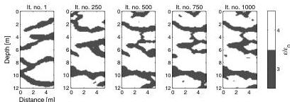
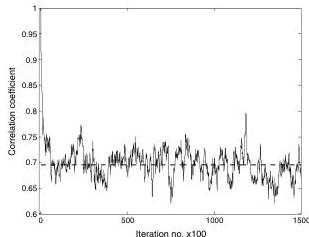

H26

Cordua et al.

characteristics of the a priori information imposed on the inverse problem and to understand the state of information provided by the data (and their uncertainties). In particular, when the a priori information is provided through a black box algorithm, and no closed-form mathematical expression of the a priori probability density exists, an a priori movie may be important to understanding whether the state of information provided by the a priori probability density is commensurate with the a priori expectation of the user. See Koren et al. (1991) for a seminal example of using the movie strategy for a seismic inverse problem.

Figure 8 shows eight statistically independent realizations drawn from the a priori probability density (i.e., an a priori movie). This movie shows the state of information provided by the a priori probability density inferred from the training image by the Snesim algorithm. This movie shows a reproduction of the channel structures inferred from the training image, but with no resemblance between the location of the channels in individual realizations, as these models are unconditioned by any data. Figure 9 shows eight statistically independent realizations from the a posteriori probability density. The result clearly demonstrates a high degree of resemblance between the individual a posteriori realizations as a result of the conditioning to the full-waveform data. The high resemblance reveals that the data provides a high resolution of the inverse problem,

despite sparse data coverage (see Figure 3). Moreover, the individual realizations only slightly deviate from the reference model (see Figure 2), which confirms the good resolution provided by the full-waveform data, their uncertainties, and the training image. The a posteriori realizations in Figure 9 show some isolated small-scale features, which are not seen in the training image. These noncontinuous effects are caused by the Snesim simulation technique because the algorithm occasionally reduces the number of conditioning data events (i.e., pixel values) to avoid singularities during calculation of the conditional probabilities. A total of 45 statistically independent realizations are obtained from the 300,000 a posteriori realizations based on the model autocorrelation analysis (see Figure 7). These realizations can be used to ask higher-order statistical questions such as what the probability of connectivity is between a channel observed in the left borehole and a channel observed in the right borehole. Figure 9d, 9f, and 9h shows some examples of missing connectivity between the boreholes marked by red circles. For example it is found that in five out of the 45 realizations there is no connection between the points A and B as marked in Figure 9a. Hence, this gives an approximate a posteriori probability of connectivity between points A and B of $(45 - 5)/45 = 89\%$.

Figure 10 shows the mean and variance calculated from the a

Figure 6. Development of the model during the first 1000 iterations. In this period, the relatively large-scale structures of the model are established. Compare with the reference model in Figure 2. Iteration no. 1 (It. no. 1) is the starting model, which is an unconditional realization of the multiple-point-based a priori model.

Figure 7. Autocorrelation analysis of the a posteriori sample to determine the number of iterations needed to obtain statistically independent realizations.

posteriori sample. It should be noted that the mean model is no longer a realization of the a posteriori probability density, but is only a statistical representation of the sample. The mean tells, in this particular case, the relative a posteriori probability of the presence of a channel at a certain position in the subsurface. The variance reveals that the uncertainty of the spatial location of the channels increases toward the edges of the channels and declines significantly when moving away from the edges.

Waveform data associated with the 45 statistically independent realizations from the a posteriori probability density are calculated for the receiver related to the uppermost transmitter position in the left borehole (see transmitter-receiver pairs marked by the numbers 1–5 in

Figure 3). This data variability associated with the model a posteriori variability is plotted in Figure 11a (blue curves) together with the observed data (red curves). The (a posteriori) simulated waveforms show a high degree of similarity and appear in the plot almost as a single fat curve, but are in fact composed of 45 independent waveform curves. Hence, the a posteriori data variability demonstrates that the model a posteriori variability is only associated with very little variability in the waveforms. Moreover, Figure 11a shows that the simulated waveforms fit the observed data very well. Figure 11b shows the data residuals (blue curves) of the simulated waveform data together with the uncertainty component of the observed data (red curves). This plot reveals that the residuals (i.e., misfits) approximately fluctuate around the uncertainty component and resemble the noise statistics (variance and temporal autocorrelation) satisfactorily.

## DISCUSSION

Hansen et al. (2006) demonstrated that linear inverse Gaussian theory and simple kriging (i.e., two-point statistics) can be merged

Downloaded 02 Mar 2012 to 130.225.69.247. Redistribution subject to SEG license or copyright; see Terms of Use at http://segdl.org/