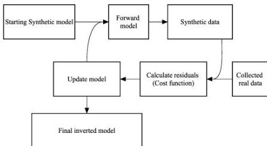

Figure 1.1: The FWI flow chart.

computer-based iterative analysis, enables us to significantly improve the initial model given to the algorithm which is equivalent to generating better quantitative estimates of subsurface properties including electrical permittivity and conductivity structures and geometry properties of subsurface features.

Chapter 2 provides an FWI algorithm specifically tailored for the surface common-offset GPR data using two popular open sources packages with a deconvolution code to estimate the source wavelet shape. The effectiveness of the proposed method is tested on models with cylindrical targets, i.e. PVC pipes, embedded in soil. Chapter 3 introduces a novel sparse blind deconvolution (SBD) algorithm for estimating the transmitted wavelet shape. The second product of the developed SBD is a sparse representation of the subsurface reflectivity model. And finally chapter 4 utilizes the developed SBD algorithm in the FWI process to map reinforced structures.

### 1.1 Full waveform inversion for PVC pipe mapping

In Chapter 2, a full-waveform inversion (FWI) method is described for improving estimates of the diameter of a pipe and confirming the infilling material (air/water/etc.) for the simple case of an isolated diffraction hyperbola on a profile run perpendicular to a pipe

3