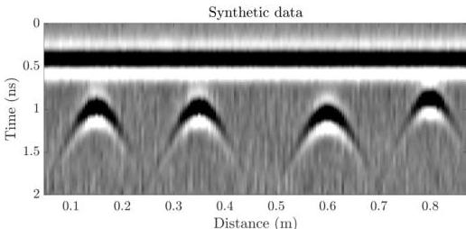

Figure 4.1: Synthetic GPR returns from four reinforcing bars embedded in concrete at depths ranging from 2.7 to 4 cm, as shown in Figure 4.3 assuming a 2.4 MHz antenna and source wavelet shown in Figure 4.4. Noise is added to the data to make the scenario more realistic.

(2010); Alani et al. (2013)). The method is particularly well suited to mapping the positions of reinforcing bars. Data with high spatial density can be acquired at vehicle driving speeds, with obvious benefits for road and bridge deck monitoring (Benedetto and Pajewski (2015)).

GPR returns depend on the material properties of the concrete and reinforcing bars, specifically the dielectric constant (i.e. relative permittivity, defined as the ratio of the electrical permittivity of the media to that of free space) and electrical conductivity. Because reinforcing bars are distinctly different than surrounding concrete, they clearly reflect EM energy and generate characteristic hyperbolic returns on GPR profiles, or B-scans (e.g. Figure 4.1). The shape and position of the hyperbola on the GPR profile is controlled by the depth and properties of the rebar, as well as the overlying concrete properties.

The problem of locating the top of the rebar (both laterally and in depth below concrete surface) from the arrival times of the peaks in the hyperbolic GPR return is relatively straightforward and is widely applied. A best fit to the hyperbola arrival times is used to estimate the velocity of the wave in the overlying concrete and thereby estimate the depth of the rebar (e.g. Al-Qadi and Lahouar (2005)). This calculation, referred to as ray-based

9